# AMLL TTML DB RAW DATA

为[amll-ttml-db](https://github.com/Steve-xmh/amll-ttml-db)提交AMLL歌词使用的存储库。

## ass2ttml.lua

<a href="https://github.com/ranhengzhang/amll-ttml-db-raw-data/blob/main/aegisub/ass2ttml-3.2.lua"></a> <a href="https://github.com/ranhengzhang/amll-ttml-db-raw-data/blob/main/aegisub/ass2ttml-3.4.lua"></a> <a href="https://aegi.vmoe.info/docs/3.2/Automation/Lua/"></a> <a href="https://help.apple.com/itc/videoaudioassetguide/#/itc0f14fecdd"></a>

> [!NOTE]
>
> 用于在 Aegisub 应用内将 ass 字幕文件直接导出可用 ttml 文件的自动化脚本。
>
> *ttml 转 ass 或其它格式戳这里 => [ranhengzhang/ttml-translater](https://github.com/ranhengzhang/ttml-translater)*

### 如何安装

1. 下载好 lua 脚本后，打开自动化页面
    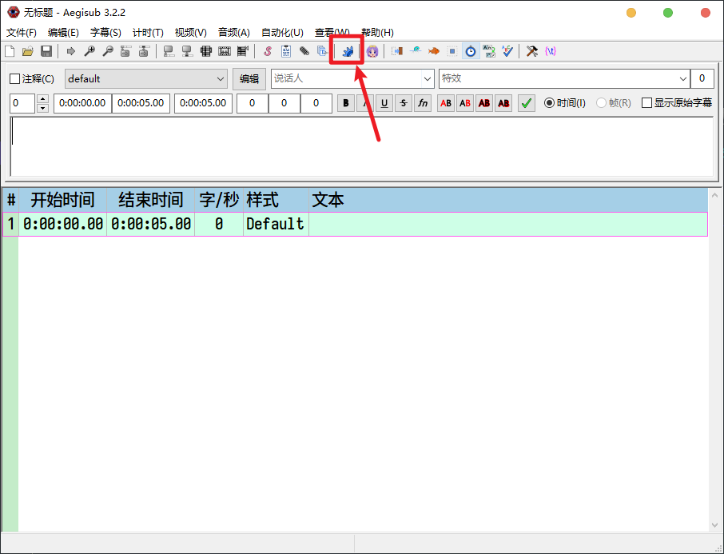
2. 随便选择一个脚本，点击「显示信息」
    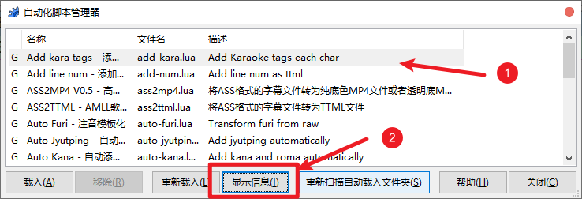
3. 在文件资源管理器中打开显示的完整路径（**只需要打开到「autoload」目录**）
    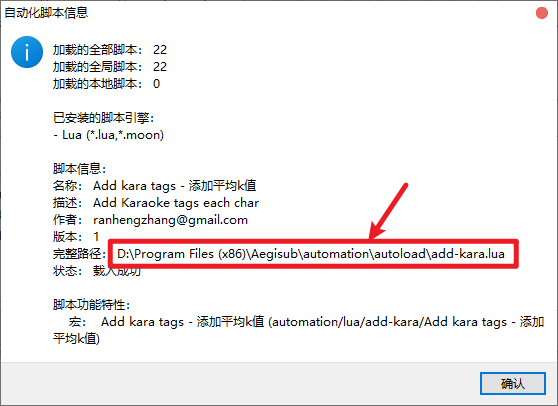
4. 将 lua 脚本放入「autoload」目录中，重新打开 Aegisub 即可在自动化列表中看见
    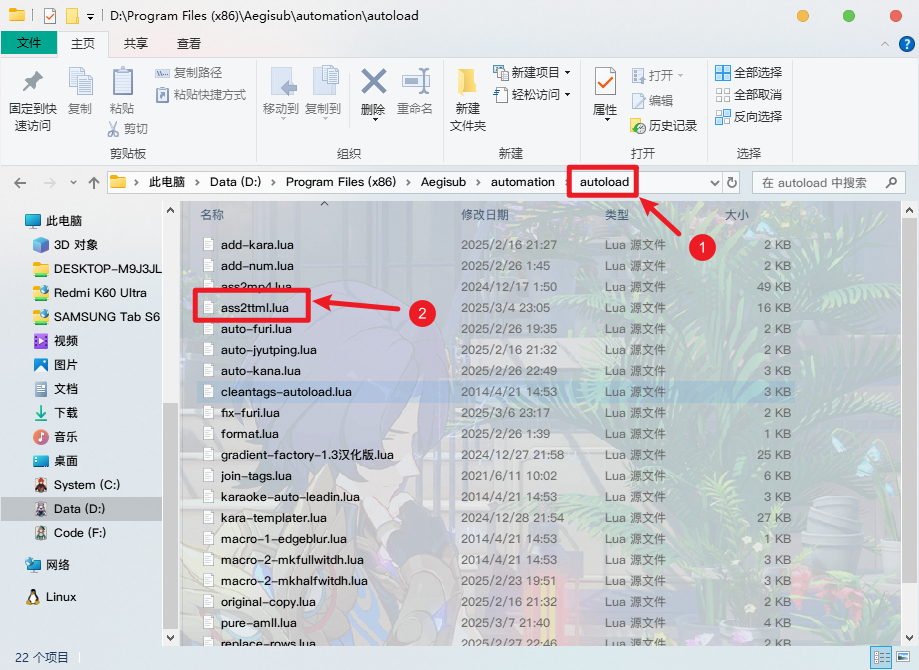
    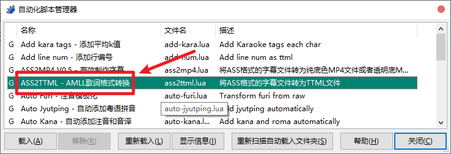

### 如何使用

该自动化脚本需要按照特定格式和标记导出正确 ttml 内容

#### 标记行类型

该脚本不会区分 Dialog 行和 Comment 行，并且只会处理「样式」为 `orig` `ts` `roma` 同时「特效」为**空**或「**karaoke**」的部分

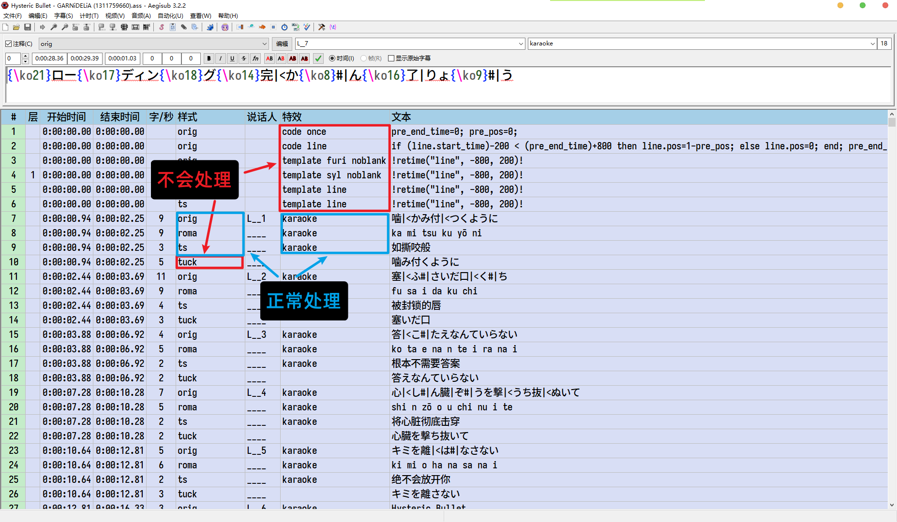

其中，`orig` 表示原文行，`ts` 表示翻译行，`roma` 表示音译行。根据这个特性，在打轴时，对于一些不希望写入 ttml 中但是又想保留的行（例如歌曲信息），可以使用不会处理的标签进行标记

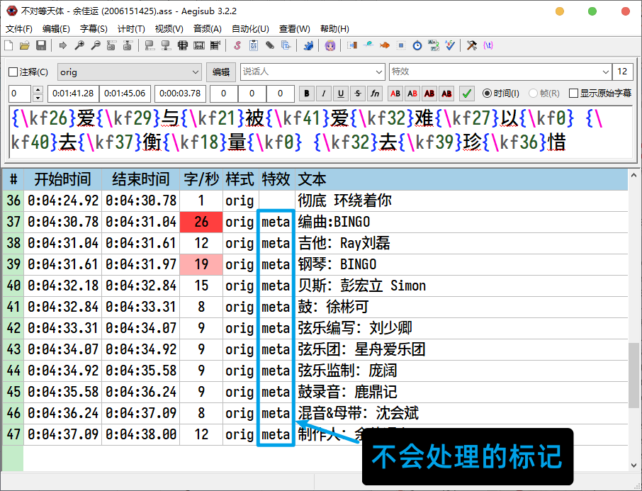

#### 标记行角色

在 ttml 中可以将行标记为**对唱**、**背景声**与**翻译语言**，在 ass 字幕中可以在说话人一栏填写相应标记进行设置，具体如下：

- `x-bg`：背景声行
- `x-duet` 或 `x-anti`：对唱行
- `x-chor`：合唱行
- `x-mark*`：用于特定标记，但不输出到 ttml 文件中
- `x-lang:*`：用于在 ts 行中标记翻译对应的语言。**(默认为 `zh-CN`)**
- `x-part:*`：用于标记新的部分的开始

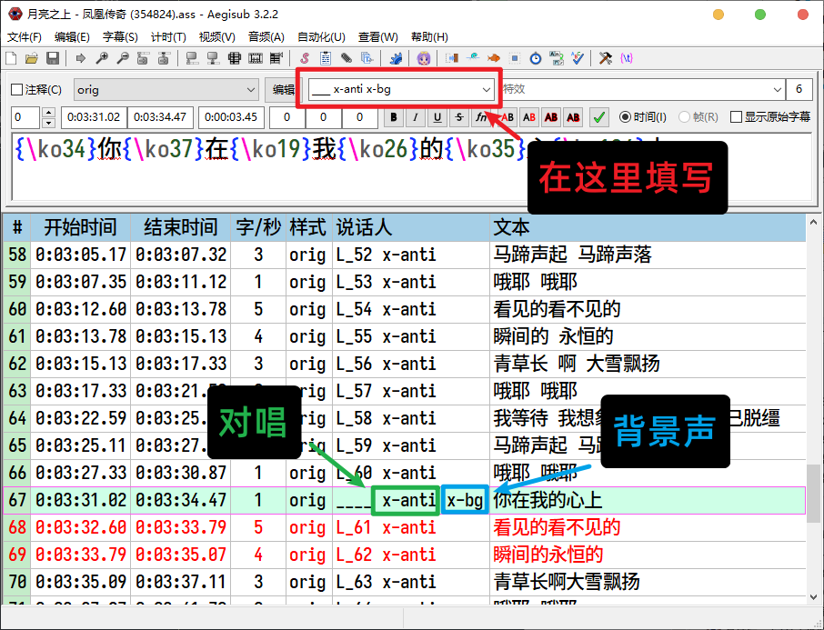

> **合唱行的处理**
>
> 当上下两行时间轴相同但是 role 不同时，使用合唱行进行标记。输出时会自动输出两行。
>
> 以下是使用 x-chor 进行标记的例子：
>
> 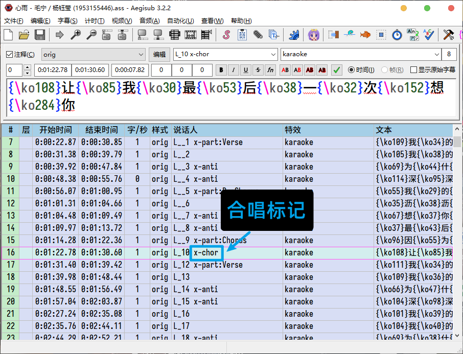
>
> 使用脚本导出为 ttml 后，被标记为合唱的部分格式化之后为：
>
> ```xml
> <p begin="01:22.780" end="01:30.600" ttm:agent="v1" itunes:key="L10">
>     <span begin="01:22.780" end="01:23.860">让</span>
>     <span begin="01:23.860" end="01:24.710">我</span>
>     <span begin="01:24.710" end="01:25.010">最</span>
>     <span begin="01:25.010" end="01:25.540">后</span>
>     <span begin="01:25.540" end="01:25.920">一</span>
>     <span begin="01:25.920" end="01:26.240">次</span>
>     <span begin="01:26.240" end="01:27.760">想</span>
>     <span begin="01:27.760" end="01:30.600">你</span>
> </p>
> <p begin="01:22.780" end="01:30.600" ttm:agent="v2" itunes:key="L11">
>     <span begin="01:22.780" end="01:23.860">让</span>
>     <span begin="01:23.860" end="01:24.710">我</span>
>     <span begin="01:24.710" end="01:25.010">最</span>
>     <span begin="01:25.010" end="01:25.540">后</span>
>     <span begin="01:25.540" end="01:25.920">一</span>
>     <span begin="01:25.920" end="01:26.240">次</span>
>     <span begin="01:26.240" end="01:27.760">想</span>
>     <span begin="01:27.760" end="01:30.600">你</span>
> </p>
> ```
>
> 

> **关于多语言翻译**
>
> 以 MARiA 的《智子》为例，这首**中文**歌在官方 MV 中给出了**英文和日文**的翻译，因此在 ass 文件中，需要标记两个 ts 行。而为了区分这两种语言，就需要使用 `x-lang` 标记指名翻译语言。
>
> 格式为 `x-lang:<languagecode>-<regioncode>`，具体有哪些类型以 amll player 开发者未来给出的为准，目前暂时遵循 **RFC 1766** 标准。
>
> - **语言代码** (ISO 639-1）：两个小写字母 (如 `zh` 表示中文，`en` 表示英语)
> - **地区代码** (ISO 3166-1）：两个大写字母 (如 `CN` 表示中国，`US` 表示美国)
>
> 以下是使用 `x-lang` 标记两种不同语言翻译的例子：
>
> 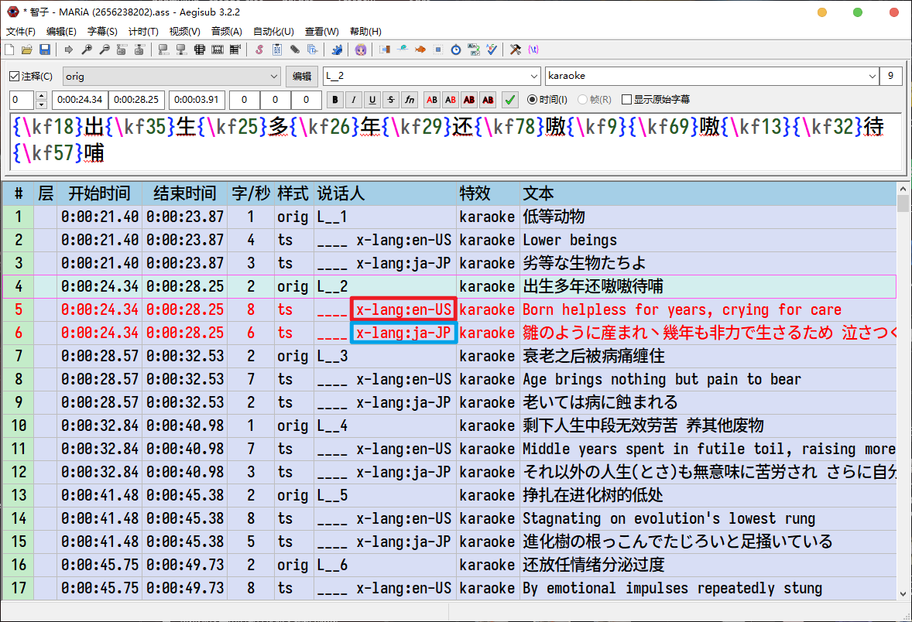

> **关于 `x-mark`**
>
> 这个标记一般用于统计一些特殊情况，譬如在 ttml 输出完成后，我需要检查一些行的输出情况，则可以为这些行打上 `x-mark` 标记。
>
> 以下是使用 `x-mark` 标记**使用了需要声明翻译来源**的行的例子：
>
> 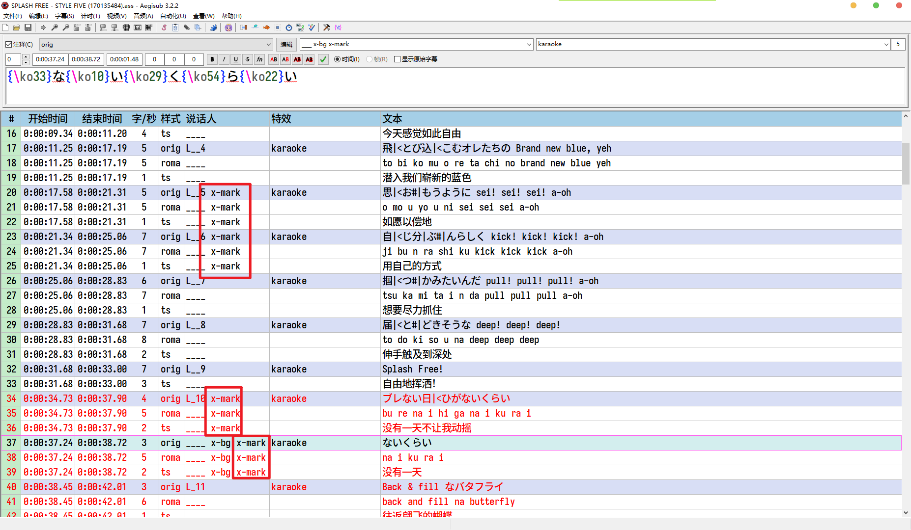
>
> 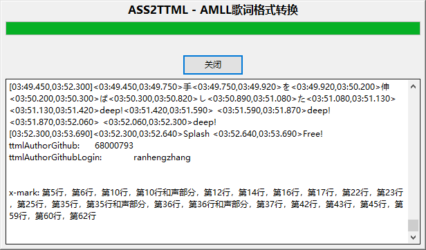
>
> `x-mark` 标记会根据后缀不同进行分组，譬如其中一些行标记了 `x-mark-a`，另一些标记了 `x-mark-b`，那么在最终统计中会分别进行输出。

> **关于 songPart**
>
> 建议依照 Apple Music 的建议进行标记：
>
> - Verse（主歌）
> - Chorus（副歌）
> - PreChorus（预副歌）
> - Bridge（桥段）
> - Intro（前奏）
> - Outro（尾奏）
> - Refrain（叠句）
> - Instrumental（器乐）
>
> 可以使用 [set-part.lua](https://github.com/ranhengzhang/amll-ttml-db-raw-data/blob/main/aegisub/set-part.lua) 脚本快速设置。

#### 标记音节类型

ass2ttml 脚本使用内联标记（[inline-fx](https://aegi.vmoe.info/docs/3.2/Karaoke_inline-fx/)）进行单音节的特殊处理，目前支持以下标记：

- 合并标记：`{\-M}` 或 `{\-merge}`，表示与前一个**有内容的**音节合并（会将夹在中间的空格也合并）。常用于在日语中，前一个汉字只发一个音，并且和后面一个字/假名连读

  > **样例**
  >
  > ```ass
  > {\ko19}何|<な{\ko8}#|ん{\ko22}度|<ど{\ko24}で{\ko44}も{\ko27}{\ko12}生|<う{\ko13}ま{\ko22}れ{\ko22}変|<か{\ko23}わ{\ko38}っ{\ko12}{\ko35}て{\ko12} {\ko7}あ{\ko8}の{\ko32}日|<ひ{\ko26}の{\ko18}{\ko16}君|<き{\ko36}#|み{\ko23}に{\ko21}{\ko24}逢|<あ{\ko46}い{\ko18}に{\ko23}{\-M}行|<い{\ko47}く{\ko252}よ
  > ```
  >
  > `{\ko18}に{\ko23}行|<い` 部分变为长音，但是如果标记为 `{\ko41}に行|<い` 则会在应用模板后导致 furi 行错位（「に<ruby>行<rt>い</rt></ruby>」变为「<ruby>に行<rt>い</rt></ruby>」），因此使用合并标记 `{\ko18}に{\ko23\-M}行|<い`，使用脚本导出后的结果为：
  >
  > ```xml
  > <span begin="03:49.320" end="03:49.730">に行</span>
  > ```

- 纯文本节点标记：`{\-T}` 或 `{\-text}`，表示导出为纯文本节点

  > **样例**
  >
  > ```ass
  > {\ko21}僕|<ぼ{\ko50}#|く{\ko22}ら{\ko27}か{\ko46}ら{\ko25}{\ko27}プ{\ko43}レ{\ko33}ゼ{\ko18}ン{\ko92}ト {\ko197}フォー{\ko0}・{\ko75}ユー{\ko0}{\T}💀
  > ```
  >
  > 专辑歌词本中，此行歌词的末尾附上了一个 Emoji，但是这个 Emoji 并不占用任何行时间，并且不好应用逐字渐变，则使用纯文本标记使其常亮，该行导出结果为：
  >
  > ```xml
  > <p begin="03:47.480" end="03:54.240" ttm:agent="v1" itunes:key="L50"><span begin="03:47.480" end="03:48.190">僕</span><span begin="03:48.190" end="03:48.410">ら</span><span begin="03:48.410" end="03:48.680">か</span><span begin="03:48.680" end="03:49.140">ら</span><span begin="03:49.390" end="03:49.660">プ</span><span begin="03:49.660" end="03:50.090">レ</span><span begin="03:50.090" end="03:50.420">ゼ</span><span begin="03:50.420" end="03:50.600">ン</span><span begin="03:50.600" end="03:51.520">ト</span><span begin="03:51.520" end="03:51.520"> </span><span begin="03:51.520" end="03:53.490">フォー・</span><span begin="03:53.490" end="03:54.240">ユー</span>💀<span ttm:role="x-roman">bo ku ra ka ra present for you</span><span ttm:role="x-translation" xml:lang="zh-CN">我们献上这份赠礼 专属于你</span></p>
  > ```

- 零时间节点标记：`{\-Z}` 或 `{\-zero}`，表示目标在导出时持续时间应为 0（*为了保持兼容性，插件在导出时会将所有持续时间为 0 并且不会合并的非文本节点持续时间设置为 5 ms*）

  > **样例**
  >
  > ```ass
  > {\kf0}“{\kf20}睡{\kf6}不{\kf21}着{\kf22}吗{\kf141\-Z}？{\kf10}没{\kf17}关{\kf29}系{\kf99}{\-Z}，{\kf11}因{\kf42}为{\kf0}”
  > ```
  >
  > 这里的「？」和「，」如果原样导出的话会触发高亮，因此使用零时间标记，导出结果如下：
  >
  > ```xml
  > <p begin="01:43.080" end="01:47.260" ttm:agent="v1" itunes:key="L29"><span begin="01:43.080" end="01:43.280">“睡</span><span begin="01:43.280" end="01:43.340">不</span><span begin="01:43.340" end="01:43.550">着</span><span begin="01:43.550" end="01:43.770">吗</span><span begin="01:43.770" end="01:43.775">？</span><span begin="01:45.180" end="01:45.280">没</span><span begin="01:45.280" end="01:45.450">关</span><span begin="01:45.450" end="01:45.740">系</span><span begin="01:45.740" end="01:45.745">，</span><span begin="01:46.730" end="01:46.840">因</span><span begin="01:46.840" end="01:47.260">为”</span></p>
  > ```

#### 输出为 TTML

##### 输出之前

在输出之前，需要将行进行一次排序，才能进行正常的输出，可以使用 Aegisub 自带的行排序进行操作。具体为 ①样式名称 ②说话人 ③开始时间。（有时可能还需要选中特殊的部分按结束时间排序）

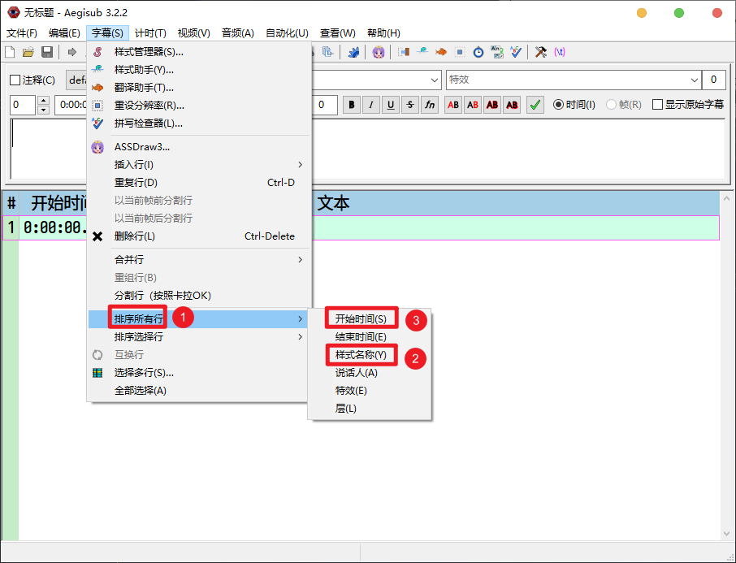

对于日语来说，最好用 [fix-furi.lua](https://github.com/ranhengzhang/amll-ttml-db-raw-data/blob/main/aegisub/fix-furi.lua) 脚本处理一次，将注音断掉的部分衔接。并且使用 [check.ass](https://github.com/ranhengzhang/amll-ttml-db-raw-data/blob/main/check.ass) 中的模板行进行一次核验。

> **处理前**
>
> ```ass
> {\ko13}僕|<ぼ{\ko8}{\ko24}#|く{\ko15}ら{\ko26}は{\ko7}{\ko19}こん{\ko29}な{\ko11}こ{\ko23}と{\ko12}し{\ko11}た{\ko26}か{\ko12}っ{\ko22}た{\ko17}の{\ko30}か{\ko67}な
> ```
>
> **处理后**
>
> ```ass
> {\ko13}僕|<ぼ{\ko8}#|{\ko24}#|く{\ko15}ら{\ko26}は{\ko7}{\ko19}こん{\ko29}な{\ko11}こ{\ko23}と{\ko12}し{\ko11}た{\ko26}か{\ko12}っ{\ko22}た{\ko17}の{\ko30}か{\ko67}な
> ```

##### 填写标签

点击自动化脚本进入导出页面

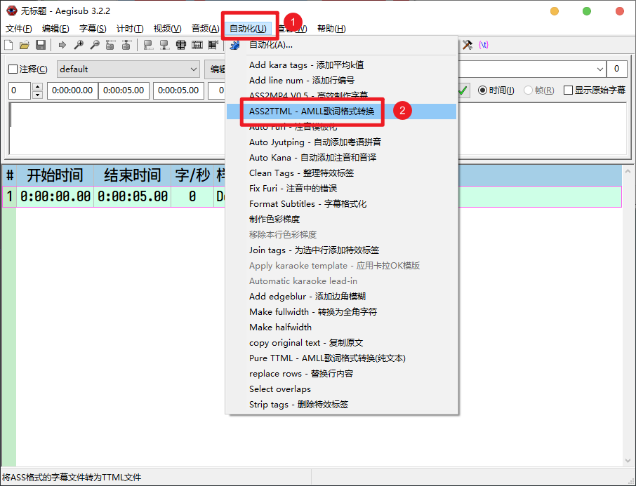

在导出页面中，填写各个标签，一个标签中的不同条目可以使用英文字符中的 `,/&` 三种字符进行分割

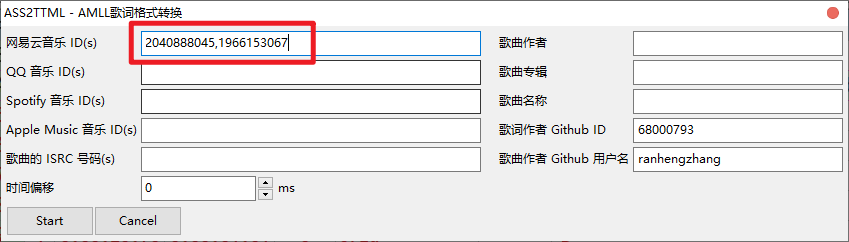

> **关于 Github ID 和 Github 用户名**
>
> 如果不想每次都输入一次这两个条目，打开 lua 脚本，搜索 `name = "ttmlAuthorGithubs"`，在该对象的最后添加一行 `value='id'`，`name = "ttmlAuthorGithubLogins"` 搜索后同理
>
> 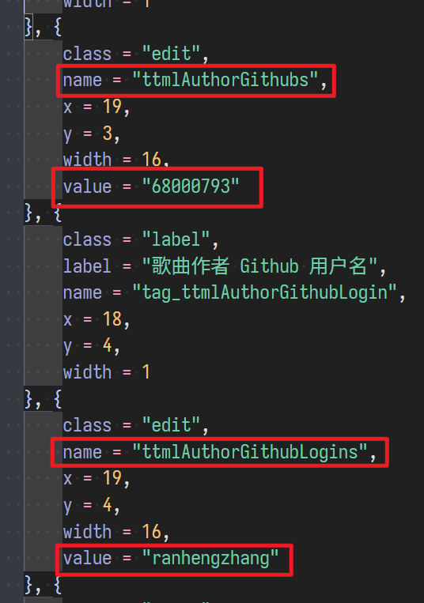

> **关于 `offset`**
>
> 如果你在使用 CD 提取的音频进行打轴，那么需要提前与平台音源比对进行一次偏移校准
>
> 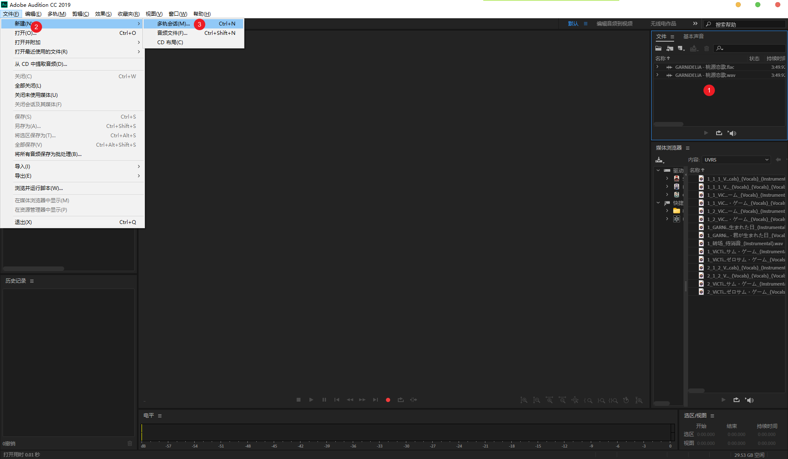
>
> 
>
> 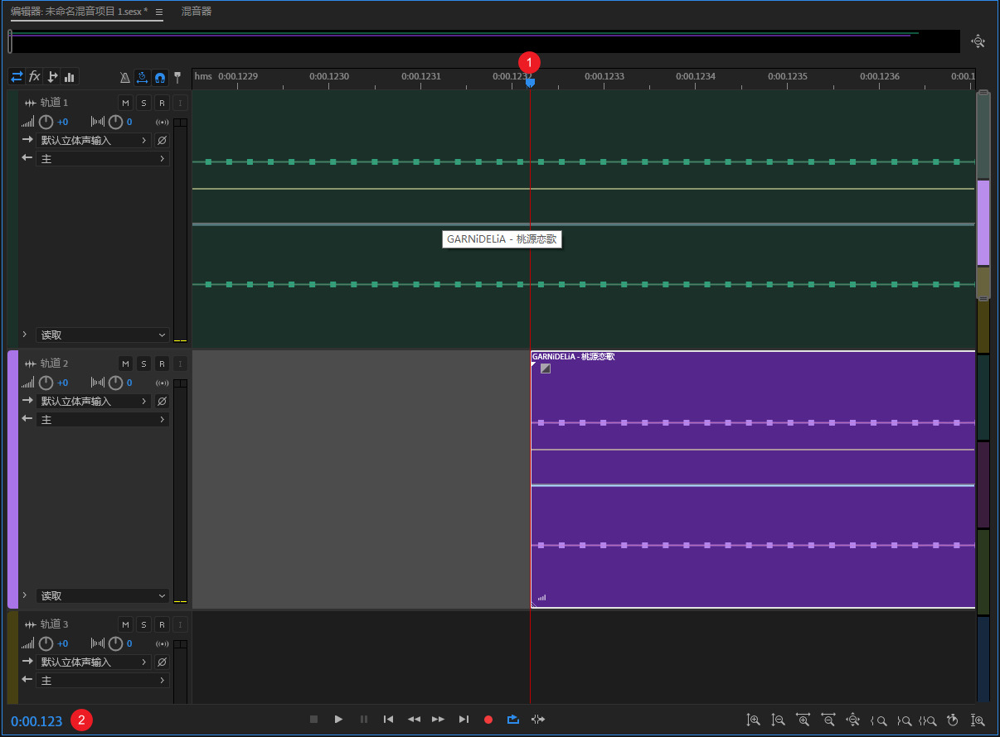
>
> 上面的例子中，我们得知平台音源相比于 CD 音源前面多了 123 ms 的空白音频，因此 offset 为 +123 ms
>
> 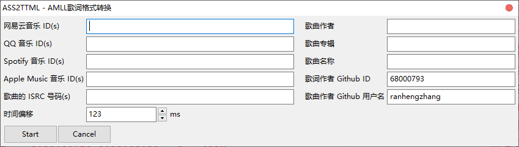
>
> 如果不想每次导出时都填写，可以打开「脚本配置」，将「更新摘要」设定为 `+123ms`，**该 ass 字幕**每次导出时都将自动设置 offset
>
> 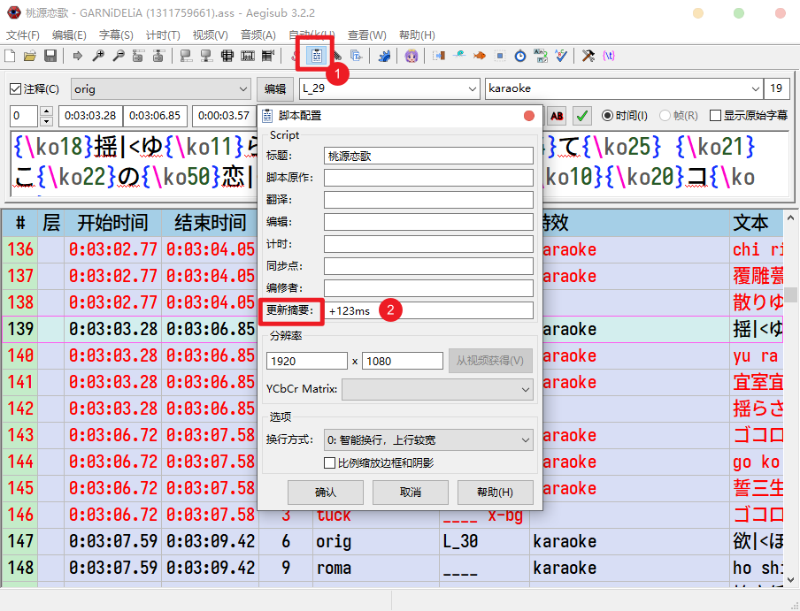

##### 选择优化

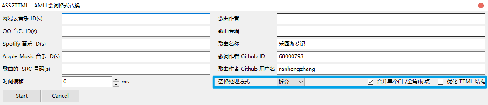

其中

- 「空格处理」有「不处理」、「合并」、「拆分」三种选项，「合并」选项会将空格合并到前一个音节的末尾，「拆分」选项则会将音节内部首/尾的空格放在音节前/后。
- 「合并单个标点」打开时会将单个标点符号合并到前一个音节中。（*如果是成对符号的前个则会向后合并*）
- 「优化 TTML 结构」打开时会将以下两种音节转换为纯文本节点：
  - 纯空格组成的音节
  - 持续时间为 0 的音节

##### 转换完成

转换完成后，将显示如下界面

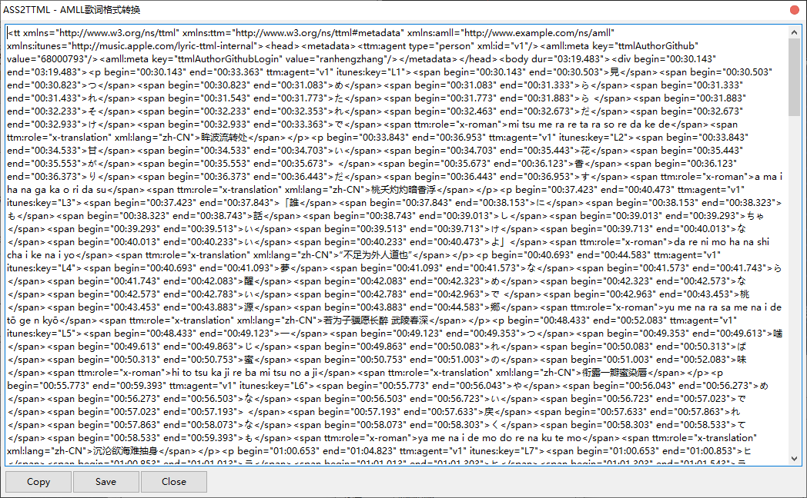

<kbd>Copy</kbd> 按钮将直接复制 ttml 文件内容到剪贴板，其中 <kbd>Save</kbd> 按钮会将 ttml 内容保存为一个 .ttml 文件。如果希望预设一个文件名，可以在「脚本配置」中设置标题，标题将作为导出文件时的默认文件名。

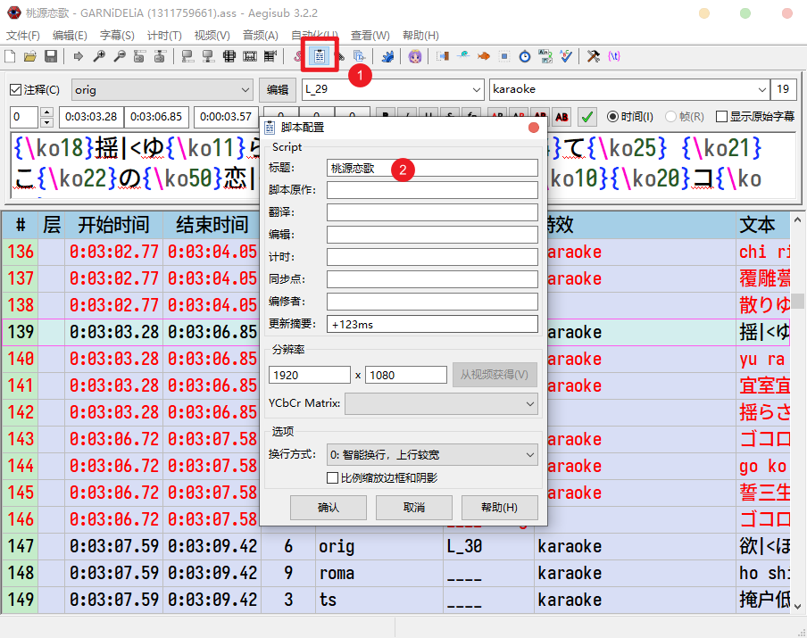

### 附：关于 furi 及 karaoke templater

在对日语歌打轴时需要进行假名标记，并且会用到 karaoke 模板处理进行预览

```plaintext
Comment: 0,0:00:00.00,0:00:00.00,orig,,0,0,0,code once,pre_end_time=0; pre_pos=0;
Comment: 0,0:00:00.00,0:00:00.00,orig,,0,0,0,code line,if (line.start_time)-200 < (pre_end_time)+800 then line.pos=1-pre_pos; else line.pos=0; end; pre_end_time=line.end_time; pre_pos=line.pos; if line.pos == 1 then line.top = line.top - line.height*1.65; line.bottom = line.bottom - line.height*1.65; end;
Comment: 0,0:00:00.00,0:00:00.00,orig,,0,0,0,template furi noblank,!retime("line", -800, 200)!{\pos(!line.left+syl.center!,!line.top-200!)\k!($sstart/10)+80!\kf!($skdur)!\fad(200,200)}
Comment: 1,0:00:00.00,0:00:00.00,orig,,0,0,0,template syl noblank,!retime("line", -800, 200)!{\pos(!line.left+syl.center!,!line.bottom-200!)\k!($sstart/10)+80!\kf!($skdur)!\fad(200,200)}
Comment: 0,0:00:00.00,0:00:00.00,roma,,0,0,0,template line,!retime("line", -800, 200)!{\fad(200,200)}
Comment: 0,0:00:00.00,0:00:00.00,ts,,0,0,0,template line,!retime("line", -800, 200)!{\fad(200,200)}
Comment: 0,0:00:30.02,0:00:33.24,orig,L__1,0,0,0,karaoke,{\ko36}見|<み{\ko32}つ{\ko26}め{\ko25}ら{\ko10}れ{\ko11}{\ko23}た{\ko11}ら {\ko35}そ{\ko12}れ{\ko11}{\ko21}だ{\ko26}け{\ko43}で
Comment: 0,0:00:30.02,0:00:33.24,roma,____,0,0,0,karaoke,mi tsu me ra re ta ra so re da ke de
Comment: 0,0:00:30.02,0:00:33.24,ts,____,0,0,0,karaoke,眸波流转处
Comment: 0,0:00:30.02,0:00:33.24,tuck,____,0,0,0,,{\kf47}見{\kf22}つ{\kf29}め{\kf28}ら{\kf16}れ{\kf30}た{\kf12}ら {\kf34}そ{\kf17}れ{\kf26}だ{\kf24}け{\kf48}で
Comment: 0,0:00:33.72,0:00:36.83,orig,L__2,0,0,0,karaoke,{\ko45}甘|<あ{\ko24}#|ま{\ko17}い{\ko50}花|<は{\ko24}#|な{\ko11}が{\ko12} {\ko23}香|<か{\ko22}#|お{\ko25}り{\ko7}だ{\ko51}す
Comment: 0,0:00:33.72,0:00:36.83,roma,____,0,0,0,karaoke,a ma i ha na ga ka o ri da su
Comment: 0,0:00:33.72,0:00:36.83,ts,____,0,0,0,karaoke,桃夭灼灼暗香浮
Comment: 0,0:00:33.72,0:00:36.83,tuck,____,0,0,0,,{\kf73}甘{\kf18}い{\kf71}花{\kf18}が {\kf48}香{\kf29}り{\kf10}だ{\kf35}す
```

该脚本在导出时，只会导出 `orig` 中被处理后的内容，比如 `{\ko45}甘|<あ{\ko24}#|ま{\ko17}い` 导出后会变为以下内容：

```plaintext
<span begin="00:33.843" end="00:34.533">甘</span>
<span begin="00:34.533" end="00:34.703">い</span>
```

而对于 karaoke templater 处理后的行。例如：

```plaintext
Dialogue: 1,0:00:32.92,0:00:37.03,orig,L__2,0,0,0,fx,{\pos(546.09375,658.8)\k80\kf69\fad(200,200)}甘
Dialogue: 1,0:00:32.92,0:00:37.03,orig,L__2,0,0,0,fx,{\pos(659.46875,658.8)\k149\kf17\fad(200,200)}い
Dialogue: 1,0:00:32.92,0:00:37.03,orig,L__2,0,0,0,fx,{\pos(772.84375,658.8)\k166\kf74\fad(200,200)}花
Dialogue: 1,0:00:32.92,0:00:37.03,orig,L__2,0,0,0,fx,{\pos(886.21875,658.8)\k240\kf11\fad(200,200)}が
Dialogue: 1,0:00:32.92,0:00:37.03,orig,L__2,0,0,0,fx,{\pos(1033.78125,658.8)\k263\kf45\fad(200,200)}香
Dialogue: 1,0:00:32.92,0:00:37.03,orig,L__2,0,0,0,fx,{\pos(1147.15625,658.8)\k308\kf25\fad(200,200)}り
Dialogue: 1,0:00:32.92,0:00:37.03,orig,L__2,0,0,0,fx,{\pos(1260.53125,658.8)\k333\kf7\fad(200,200)}だ
Dialogue: 1,0:00:32.92,0:00:37.03,orig,L__2,0,0,0,fx,{\pos(1373.90625,658.8)\k340\kf51\fad(200,200)}す
Dialogue: 0,0:00:32.92,0:00:37.03,orig-furigana,L__2,0,0,0,fx,{\pos(518.0390625,530.8)\k80\kf45\fad(200,200)}あ
Dialogue: 0,0:00:32.92,0:00:37.03,orig-furigana,L__2,0,0,0,fx,{\pos(574.1484375,530.8)\k125\kf24\fad(200,200)}ま
Dialogue: 0,0:00:32.92,0:00:37.03,orig-furigana,L__2,0,0,0,fx,{\pos(744.7890625,530.8)\k166\kf50\fad(200,200)}は
Dialogue: 0,0:00:32.92,0:00:37.03,orig-furigana,L__2,0,0,0,fx,{\pos(800.8984375,530.8)\k216\kf24\fad(200,200)}な
Dialogue: 0,0:00:32.92,0:00:37.03,orig-furigana,L__2,0,0,0,fx,{\pos(1005.7265625,530.8)\k263\kf23\fad(200,200)}か
Dialogue: 0,0:00:32.92,0:00:37.03,orig-furigana,L__2,0,0,0,fx,{\pos(1061.8359375,530.8)\k286\kf22\fad(200,200)}お
Dialogue: 0,0:00:32.92,0:00:37.03,roma,____,0,0,0,fx,{\fad(200,200)}a ma i ha na ga ka o ri da su
Dialogue: 0,0:00:32.92,0:00:37.03,ts,____,0,0,0,fx,{\fad(200,200)}桃夭灼灼暗香浮
```

由于「特效」列为 `fx`，因此不必担心影响导出内容