# AMLL TTML DB RAW DATA

为 [amll-ttml-db](https://github.com/Steve-xmh/amll-ttml-db) 提交 TTML 歌词使用的存储库。

> [!TIP]
>
> Aegisub 简易打轴教程戳 👉 [aegisub.md](./aegisub.md)。

## ass2ttml.v2.lua

<div align="center"><a href="https://github.com/ranhengzhang/amll-ttml-db-raw-data/blob/main/aegisub/ass2ttml.v2.lua"></a><a href="https://github.com/ranhengzhang/amll-ttml-db-raw-data/blob/main/aegisub/ass2ttml-3.4.lua"></a> <a href="https://aegi.vmoe.info/docs/3.2/Automation/Lua/"></a> <a href="https://help.apple.com/itc/videoaudioassetguide/#/itc0f14fecdd"></a></div>

> [!TIP]
>
> 用于在 Aegisub 应用内将 ass 字幕文件直接导出可用 ttml 文件的自动化脚本，并且支持逐字音译/翻译。不过由于一些软件无法很好地解析新版 TTML，因此如果没有逐字翻译/音译需求的话，建议使用 [ass2ttml.lua](https://github.com/ranhengzhang/amll-ttml-db-raw-data?tab=readme-ov-file#ass2ttmllua) 制作旧版 TTML。
>
> *v2 版本的转换器正在制作中 （＾ω＾）*

### 如何安装

1. 下载好 lua 脚本后，打开自动化页面；
   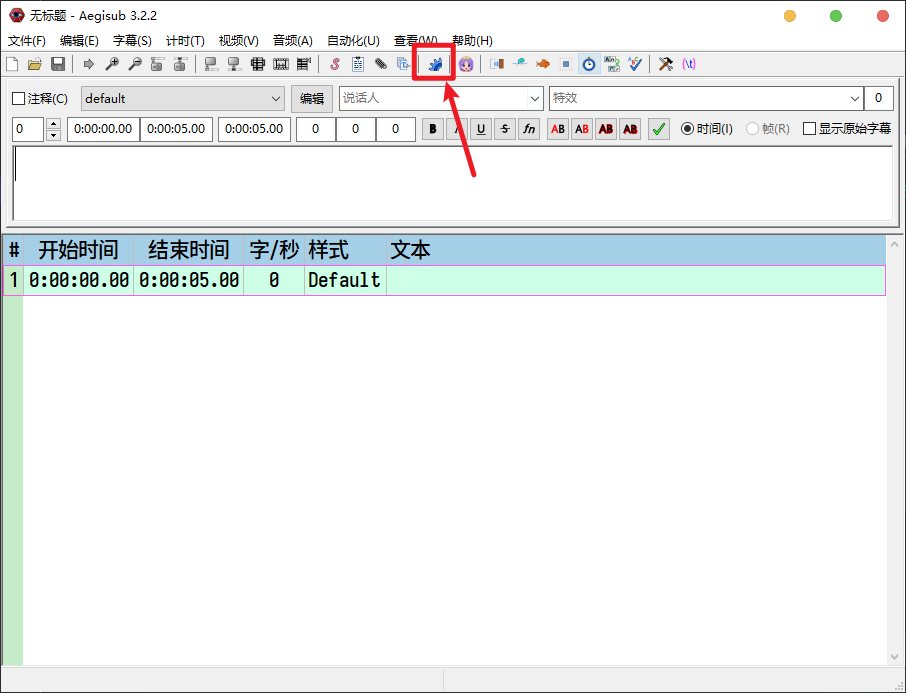
2. 随便选择一个脚本，点击「显示信息」；
   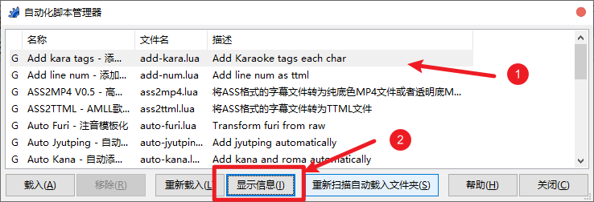
3. 在文件资源管理器中打开显示的完整路径；（**只需要打开到「autoload」目录**）
   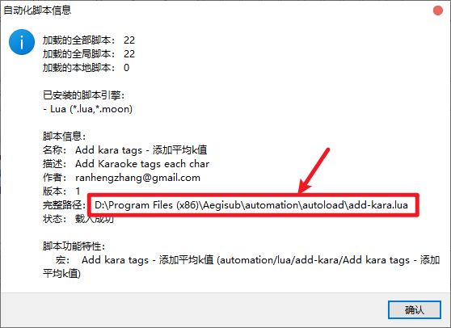
4. 将 lua 脚本放入「autoload」目录中，重新打开 Aegisub 即可在自动化列表中看见。
   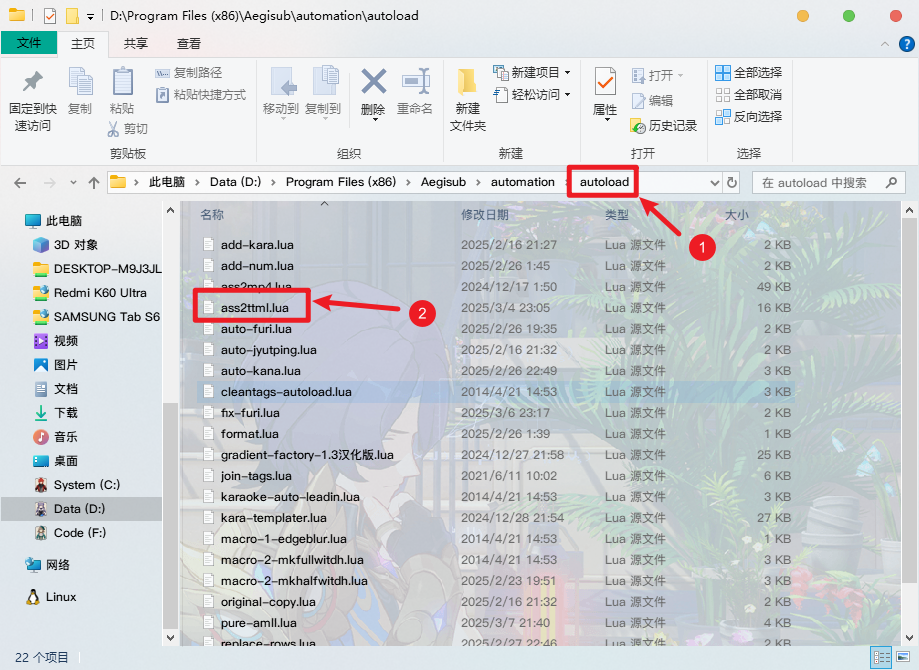
   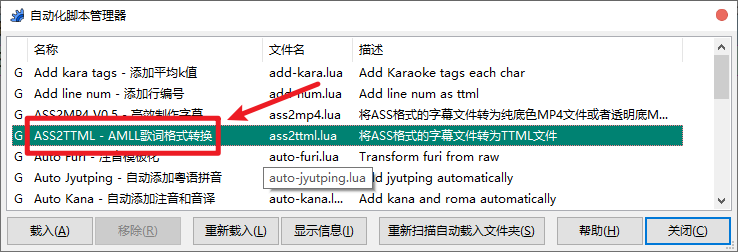

### 如何使用

该自动化脚本需要按照特定格式和标记导出正确 ttml 内容。

> **写在前面**
>
> 新版的 TTML 中多处需要显性声明语言类型，遵循 IETF 的 BCP-47 标准，以下是一些常用的语言代码：
>
> - `zh-Hans` - 简体中文；
> - `zh-Hant` - 繁体中文 (粤语同样使用)；
> - `zh-Latn-pinyin` - 中文拼音 (不分繁简)；
> - `zh-Latn-jyutping` - 粤语注音；
> - `en` - 英文；
> - `ja` - 日语；
> - `ja-Latn` - 日语罗马音；
> - `ko` - 韩语；
> - `ko-Latn` - 韩语罗马音。

#### 标记整体信息

##### 关于歌词语言

新版本的 TTML 文件**强制要求**声明歌词正文的语言，并遵循 IETF 的 BCP-47 标准，如果不想每次都填写，可打开脚本设置，填写在「脚本原作」一栏，每次导出时将自动读取，如果没有设置则导出时默认为 `zh-Hans`。

##### 关于 `offset`

如果你在使用 CD 提取的音频进行打轴或为同一首歌的不同平台制作歌词，那么需要提前比对进行一次偏移校准。

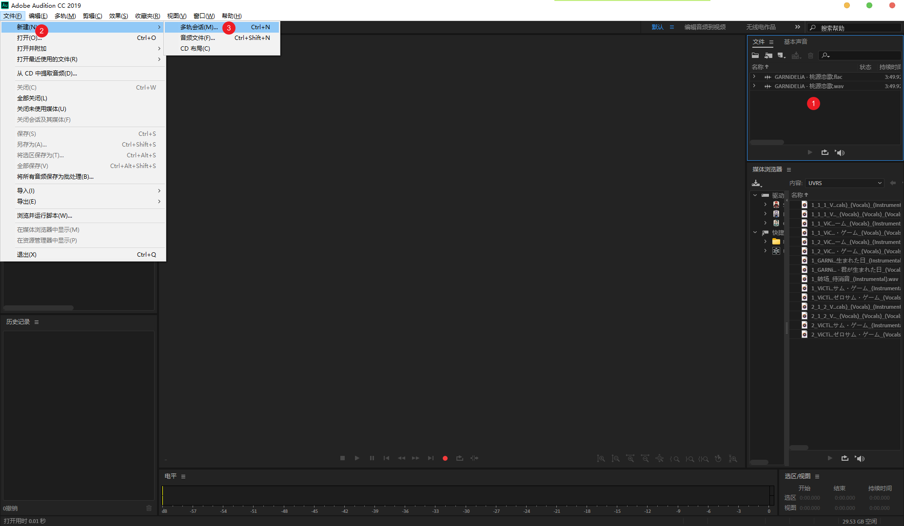

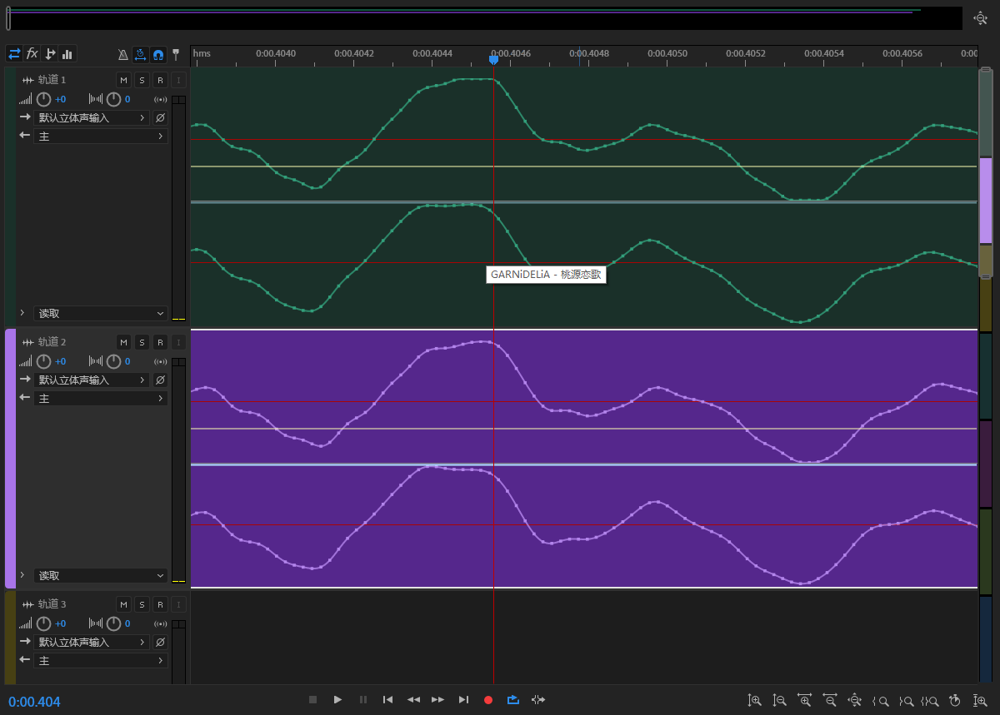

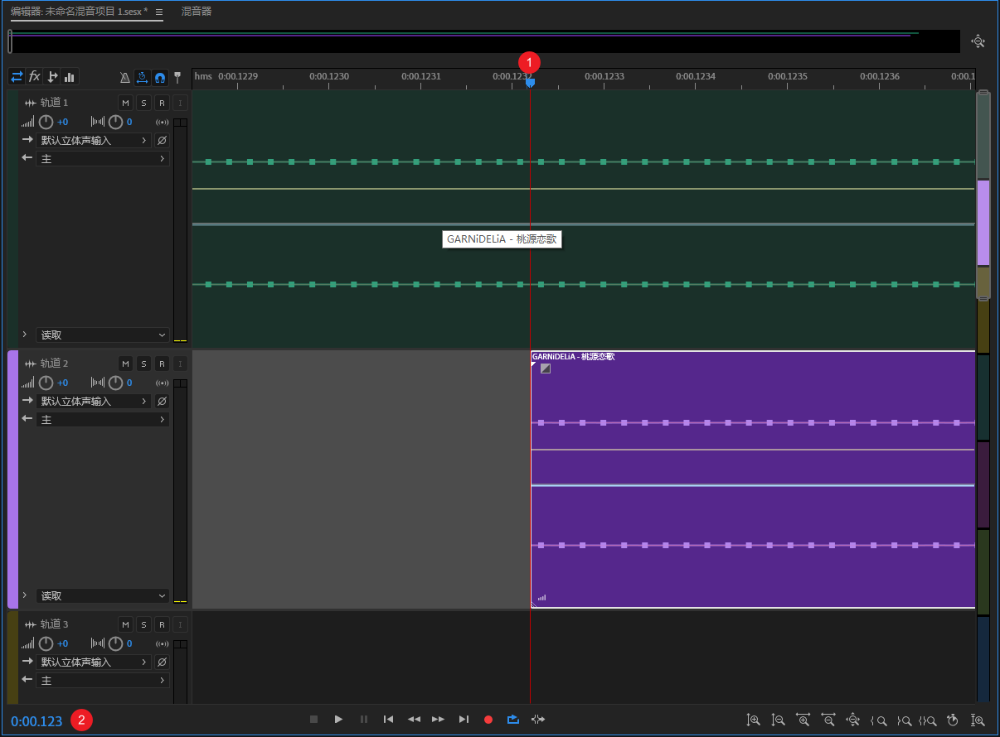

上面的例子中，我们得知平台音源相比于 CD 音源前面多了 123 ms 的空白音频，因此 offset 为 +123 ms。

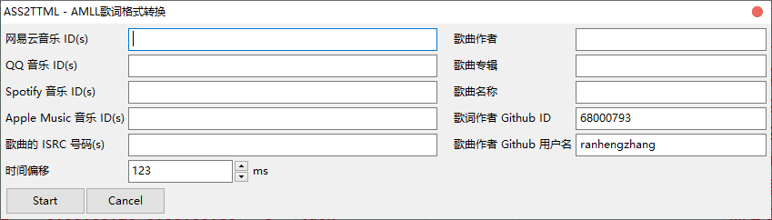

如果不想每次导出时都填写，可以打开「脚本配置」，将「更新摘要」设定为 `+123ms`，**该 ass 字幕**每次导出时都将自动设置 offset。

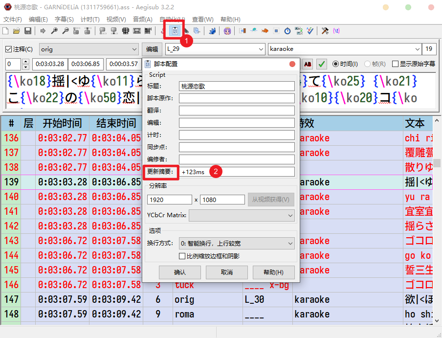

offset 可以填写多个值，但请注意，如果填写了两个及两个以上，则输入框会变为下拉列表，默认什么的不选表示没有偏移，下拉选择已有偏移值。（中括号中的内容会被忽略）

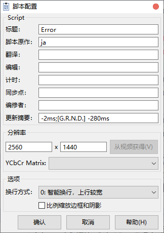

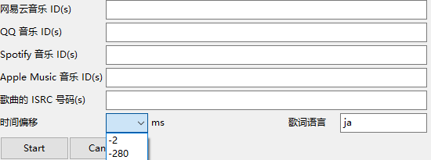

#### 标记行类型

该脚本不会区分 Dialog 行和 Comment 行，并且只会处理「样式」为 `orig` `ts` `roma` 同时「特效」为**空**或「**karaoke**」的部分

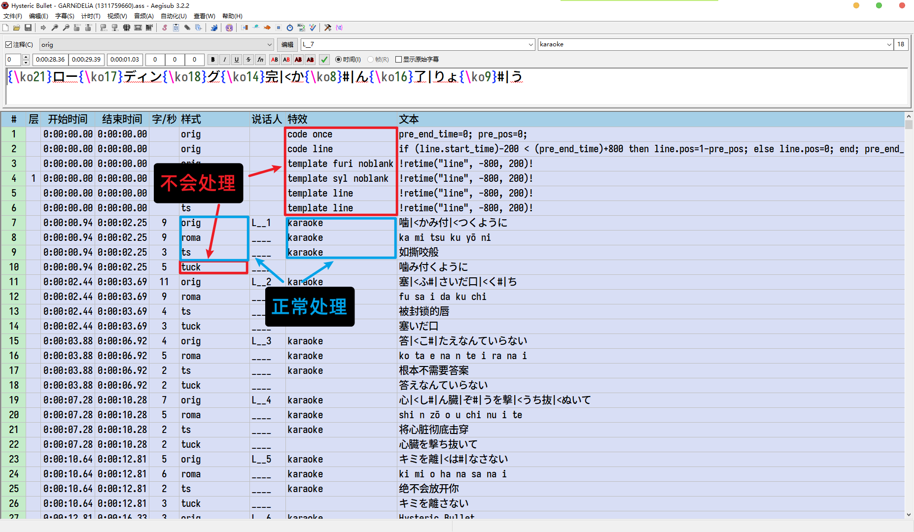

其中，`orig` 表示原文行，`ts` 表示翻译行，`roma` 表示音译行。根据这个特性，在打轴时，对于一些不希望写入 ttml 中但是又想保留的行（例如歌曲信息），可以使用不会处理的标签进行标记

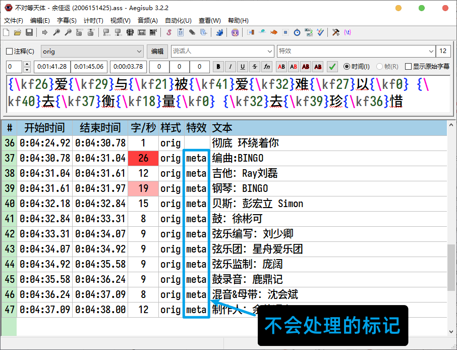

#### 标记行角色

在 ttml 中可以将行标记为**对唱**、**背景声**与**翻译语言**，在 ass 字幕中可以在说话人一栏填写相应标记进行设置，具体如下：

- `x-bg`：背景声行
- `x-duet` `x-solo` 和 `x-anti`：都是对唱行，**只有语义上的不同，实际效果都为分配到右边对唱**
- `x-chor`：合唱行
- `x-replace`：逐字翻译行
- `x-mark*`：用于特定标记，但不输出到 ttml 文件中
- `x-lang:*`：用于在 ts/roma 行中标记翻译对应的语言，遵循 IETF 的 BCP-47 标准。**(ts 行默认为 `zh-Hans`，roma 行默认为 `歌词语言-Latn`)**
- `x-part:*`：用于标记新的部分的开始

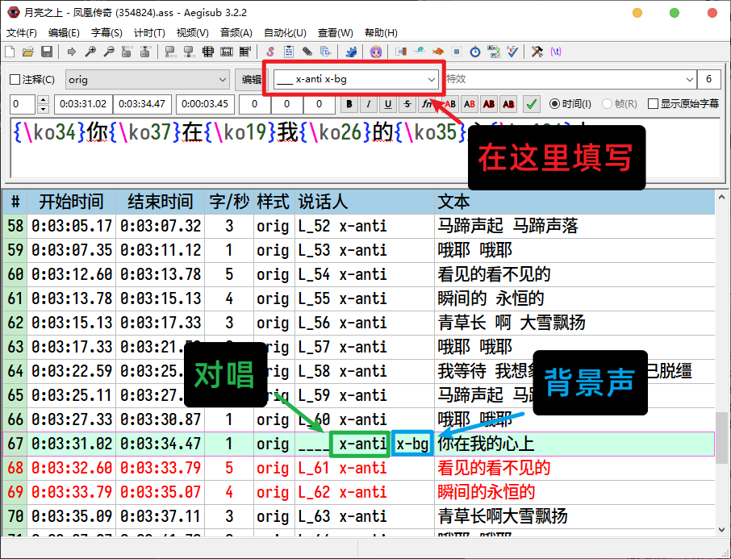

##### 合唱行的处理

当上下两行时间轴相同但是 role 不同时，使用合唱行进行标记。输出时会自动输出两行。

以下是使用 `x-chor` 进行标记的例子：

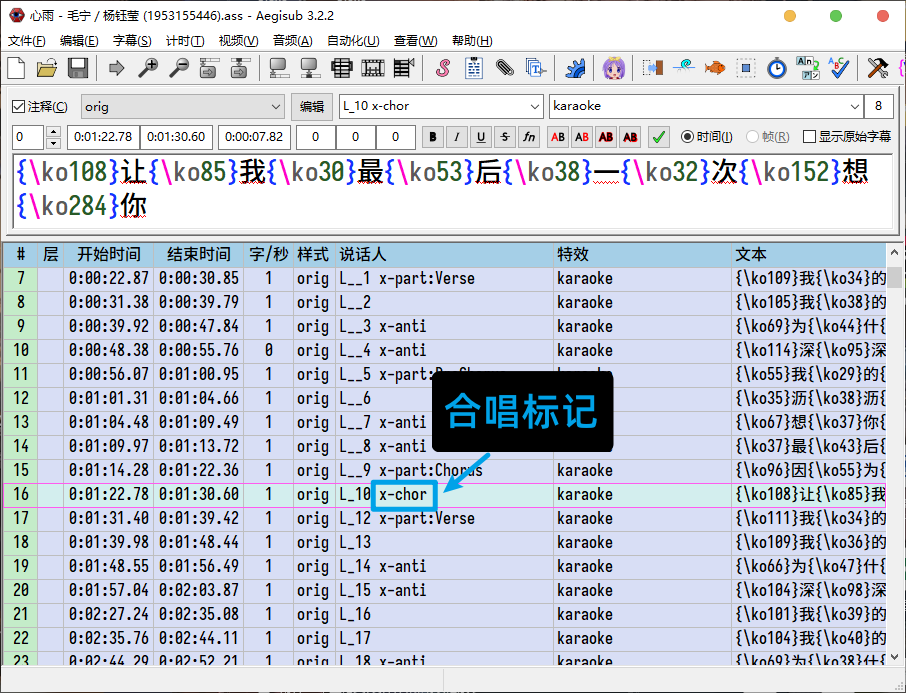

使用脚本导出为 ttml 后，被标记为合唱的部分格式化之后为：

> [raw-data/杨钰莹/水晶之恋 (浪漫情歌对唱精选)/心雨 - 毛宁／杨钰莹 (1953155446).ass](https://github.com/ranhengzhang/amll-ttml-db-raw-data/blob/main/raw-data/%E6%9D%A8%E9%92%B0%E8%8E%B9/%E6%B0%B4%E6%99%B6%E4%B9%8B%E6%81%8B%20(%E6%B5%AA%E6%BC%AB%E6%83%85%E6%AD%8C%E5%AF%B9%E5%94%B1%E7%B2%BE%E9%80%89)/%E5%BF%83%E9%9B%A8%20-%20%E6%AF%9B%E5%AE%81%EF%BC%8F%E6%9D%A8%E9%92%B0%E8%8E%B9%20(1953155446).ass#L55-L56)
>
> <pre lang="ass">
> Comment: 0,0:04:01.43,0:04:08.38,orig,L_30 <b>x-chor</b> x-part:Refrain,0,0,0,karaoke,{\ko107}深{\ko91}深{\ko30}地{\ko48}把{\ko36}你{\ko126}想{\ko257}起
> Comment: 0,0:04:09.93,0:04:19.34,orig,L_32 <b>x-chor</b>,0,0,0,karaoke,{\ko114}深{\ko99}深{\ko28}地{\ko69}把{\ko47}你{\ko198}想{\ko386}起
> </pre>
>
>
> ```xml
> <div begin="04:01.430" end="00:00.000" itunes:songPart="Refrain">
> 	<p begin="04:01.430" end="04:08.380" ttm:agent="v1" itunes:key="L30">
> 		<span begin="04:01.430" end="04:02.500">深</span>
> 		<span begin="04:02.500" end="04:03.410">深</span>
> 		<span begin="04:03.410" end="04:03.710">地</span>
> 		<span begin="04:03.710" end="04:04.190">把</span>
> 		<span begin="04:04.190" end="04:04.550">你</span>
> 		<span begin="04:04.550" end="04:05.810">想</span>
> 		<span begin="04:05.810" end="04:08.380">起</span>
> 	</p>
> 	<p begin="04:01.430" end="04:08.380" ttm:agent="v2" itunes:key="L31">
> 		<span begin="04:01.430" end="04:02.500">深</span>
> 		<span begin="04:02.500" end="04:03.410">深</span>
> 		<span begin="04:03.410" end="04:03.710">地</span>
> 		<span begin="04:03.710" end="04:04.190">把</span>
> 		<span begin="04:04.190" end="04:04.550">你</span>
> 		<span begin="04:04.550" end="04:05.810">想</span>
> 		<span begin="04:05.810" end="04:08.380">起</span>
> 	</p>
> 	<p begin="04:09.930" end="04:19.340" ttm:agent="v1" itunes:key="L32">
> 		<span begin="04:09.930" end="04:11.070">深</span>
> 		<span begin="04:11.070" end="04:12.060">深</span>
> 		<span begin="04:12.060" end="04:12.340">地</span>
> 		<span begin="04:12.340" end="04:13.030">把</span>
> 		<span begin="04:13.030" end="04:13.500">你</span>
> 		<span begin="04:13.500" end="04:15.480">想</span>
> 		<span begin="04:15.480" end="04:19.340">起</span>
> 	</p>
> 	<p begin="04:09.930" end="04:19.340" ttm:agent="v2" itunes:key="L33">
> 		<span begin="04:09.930" end="04:11.070">深</span>
> 		<span begin="04:11.070" end="04:12.060">深</span>
> 		<span begin="04:12.060" end="04:12.340">地</span>
> 		<span begin="04:12.340" end="04:13.030">把</span>
> 		<span begin="04:13.030" end="04:13.500">你</span>
> 		<span begin="04:13.500" end="04:15.480">想</span>
> 		<span begin="04:15.480" end="04:19.340">起</span>
> 	</p>
> </div>
> ```

如果标记了 `x-chor` 的同时标记了 `x-anti/x-duet`，那么输出时第一行为 `v2`，第二行为 `v1`。

可以配合 `x-bg` 使用，此时输出的不再是对唱的两行，而是时间轴完全相同的主行和背景行：

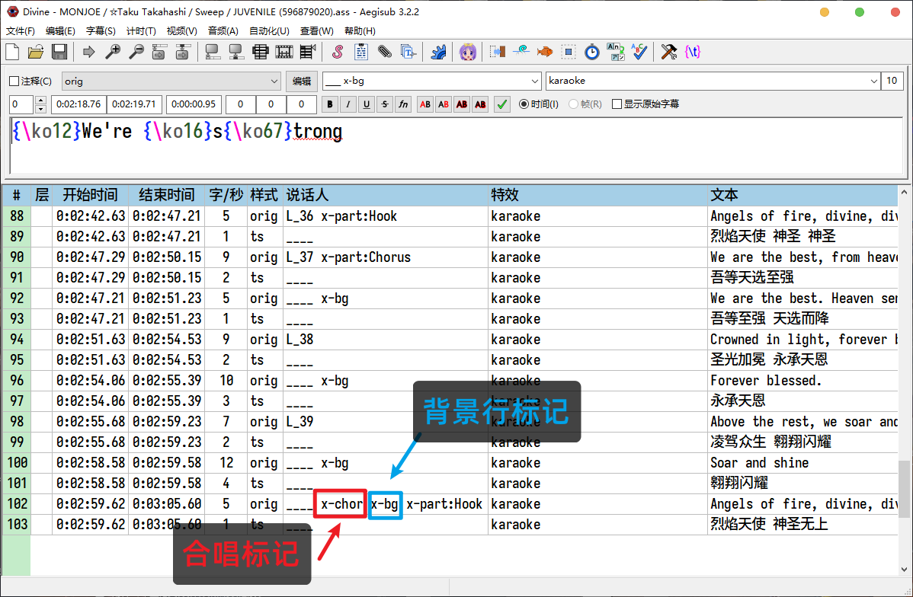

> [raw-data/New PANTY & STOCKING with GARTERBELT/Divine/Divine - MONJOE／☆Taku Takahashi／Sweep／JUVENILE (596879020).ass](https://github.com/ranhengzhang/amll-ttml-db-raw-data/blob/main/raw-data/New%20PANTY%20%26%20STOCKING%20with%20GARTERBELT/Divine/Divine%20-%20MONJOE%EF%BC%8F%E2%98%86Taku%20Takahashi%EF%BC%8FSweep%EF%BC%8FJUVENILE%20(596879020).ass#L125-L126)
>
> <pre lang="ass">
> Dialogue: 0,0:02:59.62,0:03:05.60,orig,____ <b>x-chor x-bg</b> x-part:Hook,0,0,0,karaoke,{\ko28}An{\ko28}gel{\ko17}s o{\ko59}f fi{\ko77}re{\ko0\-Z},{\ko60} {\ko15}di{\ko42}vi{\ko49}ne{\ko0\-Z}, {\ko17}di{\ko30}vi{\ko59}ne {\ko19}di{\ko34}vi{\ko64}ne
> Dialogue: 0,0:02:59.62,0:03:05.60,ts,____ ,0,0,0,karaoke,烈焰天使 神圣无上
> </pre>
>
> ```xml
> <div begin="02:59.877" end="00:00.000" itunes:song-part="Hook">
> 	<p begin="02:59.877" end="03:05.857" ttm:agent="v1" itunes:key="L40">
> 		<span begin="02:59.877" end="03:00.157">An</span>
> 		<span begin="03:00.157" end="03:00.437">gel</span>
> 		<span begin="03:00.437" end="03:00.607">s o</span>
> 		<span begin="03:00.607" end="03:01.197">f fi</span>
> 		<span begin="03:01.197" end="03:01.967">re</span>
> 		<span begin="03:01.967" end="03:01.972">,</span>
> 		<span begin="03:01.967" end="03:02.567"> </span>
> 		<span begin="03:02.567" end="03:02.717">di</span>
> 		<span begin="03:02.717" end="03:03.137">vi</span>
> 		<span begin="03:03.137" end="03:03.627">ne</span>
> 		<span begin="03:03.627" end="03:03.632">,</span>
> 		<span begin="03:03.627" end="03:03.627"> </span>
> 		<span begin="03:03.627" end="03:03.797">di</span>
> 		<span begin="03:03.797" end="03:04.097">vi</span>
> 		<span begin="03:04.097" end="03:04.687">ne</span>
> 		<span begin="03:04.687" end="03:04.687"> </span>
> 		<span begin="03:04.687" end="03:04.877">di</span>
> 		<span begin="03:04.877" end="03:05.217">vi</span>
> 		<span begin="03:05.217" end="03:05.857">ne</span>
> 		<span ttm:role="x-translation" xml:lang="zh-CN">烈焰天使 神圣无上</span>
> 		<span ttm:role="x-bg" begin="02:59.877" end="03:05.857">
> 			<span begin="02:59.877" end="03:00.157">(An</span>
> 			<span begin="03:00.157" end="03:00.437">gel</span>
> 			<span begin="03:00.437" end="03:00.607">s o</span>
> 			<span begin="03:00.607" end="03:01.197">f fi</span>
> 			<span begin="03:01.197" end="03:01.967">re</span>
> 			<span begin="03:01.967" end="03:01.972">,</span>
> 			<span begin="03:01.967" end="03:02.567"> </span>
> 			<span begin="03:02.567" end="03:02.717">di</span>
> 			<span begin="03:02.717" end="03:03.137">vi</span>
> 			<span begin="03:03.137" end="03:03.627">ne</span>
> 			<span begin="03:03.627" end="03:03.632">,</span>
> 			<span begin="03:03.627" end="03:03.627"> </span>
> 			<span begin="03:03.627" end="03:03.797">di</span>
> 			<span begin="03:03.797" end="03:04.097">vi</span>
> 			<span begin="03:04.097" end="03:04.687">ne</span>
> 			<span begin="03:04.687" end="03:04.687"> </span>
> 			<span begin="03:04.687" end="03:04.877">di</span>
> 			<span begin="03:04.877" end="03:05.217">vi</span>
> 			<span begin="03:05.217" end="03:05.857">ne)</span>
> 			<span ttm:role="x-translation" xml:lang="zh-CN">烈焰天使 神圣无上</span>
> 		</span>
> 	</p>
> </div>
> ```

##### 使用 songPart 分段

建议依照 [Apple Music 的建议](https://help.apple.com/itc/videoaudioassetguide/#/itcd7579a252:~:text=%E7%A0%81%E7%9A%84%E8%AF%B4%E6%98%8E%E3%80%82-,%E6%AD%8C%E8%AF%8D%E7%9A%84%20Apple%20%E6%89%A9%E5%B1%95,-%E6%AD%8C%E6%9B%B2%E7%BB%84%E6%88%90%E9%83%A8%E5%88%86)进行标记：

- Verse（主歌）
- Chorus（副歌）
- PreChorus（预副歌）
- Bridge（桥段）
- Intro（前奏）
- Outro（尾奏）
- Refrain（叠句）
- Instrumental（器乐）
- Hook（钩子）

可以使用 [set-part.lua](https://github.com/ranhengzhang/amll-ttml-db-raw-data/blob/main/aegisub/set-part.lua) 脚本快速设置。

##### 使用 `x-mark` 标记

这个标记一般用于统计一些特殊情况，譬如在 ttml 输出完成后，我需要检查一些行的输出情况，则可以为这些行打上 `x-mark` 标记。

以下是使用 `x-mark` 标记**使用了需要声明翻译来源**的行的例子：

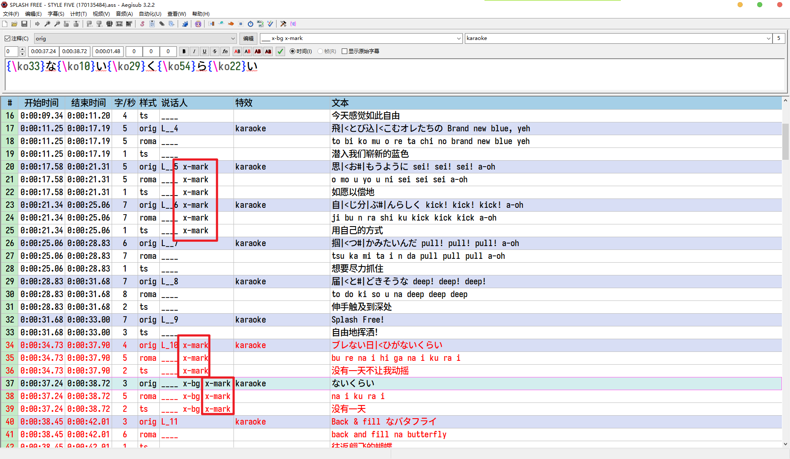

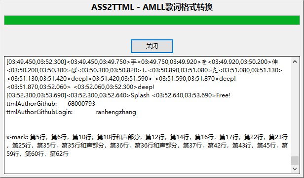

`x-mark` 标记会根据后缀不同进行分组，譬如其中一些行标记了 `x-mark-a`，另一些标记了 `x-mark-b`，那么在最终统计中会分别进行输出。

> [!NOTE]
>
> **关于多语言翻译**
>
> 以 MARiA 的《智子》为例，这首**中文**歌在官方 MV 中给出了**英文和日文**的翻译，因此在 ass 文件中，需要标记两个 ts 行。而为了区分这两种语言，就需要使用 `x-lang` 标记指明翻译语言。
>
> 格式为 `x-lang:<languagecode>`，遵循 IETF 的 BCP-47 标准。
>
> 以下是使用 `x-lang` 标记两种不同语言翻译的例子**（样例中的语言代码已经过时，请替换为 `en` 和 `ja`）**：
>
> 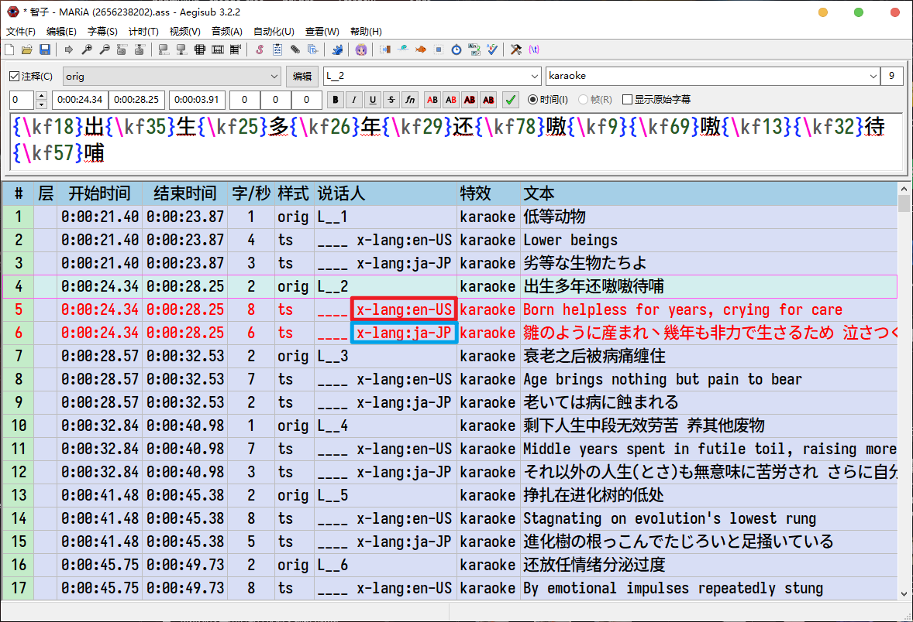
>
> 由于目前支持 ttml 的播放器少有兼容多语言翻译的情况，因此使用前可以用 [ranhengzhang/ttml-trans-filter](https://github.com/ranhengzhang/ttml-trans-filter) 提取需要的**一种**翻译。

#### 逐字音译/翻译

> [!TIP]
>
> 由于各种软件解析器的处理方式不同，建议输出后使用 [ranhengzhang/c-ttml-trans-tool](https://github.com/ranhengzhang/c-ttml-trans-tool) 压缩一次。

制作逐字音译和翻译时需要严格分词，保证音译/翻译行分词遵循一定规则：

- 音译中的空格需要合并到前一个有效音节中；

- 默认逐字翻译/音译行分词和主行分词一致；

  > [raw-data/陈奕迅/What's Going On/富士山下 - 陈奕迅 (65766).ass](https://github.com/ranhengzhang/amll-ttml-db-raw-data/blob/main/raw-data/%E9%99%88%E5%A5%95%E8%BF%85/What's%20Going%20On/%E5%AF%8C%E5%A3%AB%E5%B1%B1%E4%B8%8B%20-%20%E9%99%88%E5%A5%95%E8%BF%85%20(65766).ass#L42-L44)
  >
  > <pre lang="ass">
  > Dialogue: 0,0:00:45.30,0:00:49.56,orig,L__6,0,0,0,karaoke,{\ko50}花{\ko40}瓣{\ko33}鋪{\ko16}滿{\ko52}心{\ko35}裏{\ko32}墳{\ko42}場{\ko48}才{\ko32}害{\ko46}怕
  > Dialogue: 0,0:00:45.30,0:00:49.56,roma,____ x-lang:zh-Latn-jyutping,0,0,0,karaoke,{\k50}faa1 {\k40}faan2 {\k33}pou1 {\k16}mun5 {\k52}sam1 {\k35}lei5 {\k32}fan4 {\k42}coeng4 {\k48}coi4 {\k32}hoi6 {\k46}paa3
  > Dialogue: 0,0:00:45.30,0:00:49.56,ts,____ x-replace x-lang:zh-Hant,0,0,0,karaoke,{\k50}花{\k40}瓣{\k33}铺{\k16}满{\k53}心{\k34}里{\k32}坟{\k42}场{\k48}才{\k32}害{\k46}怕
  > </pre>
  > 
  > <table border="1">
  > <tr>
  > <td><code>orig</code></td>
  > <td><kbd>花</kbd></td><td><kbd>瓣</kbd></td><td><kbd>鋪</kbd></td><td><kbd>滿</kbd></td><td><kbd>心</kbd></td><td><kbd>裏</kbd></td><td><kbd>墳</kbd></td><td><kbd>場</kbd></td><td><kbd>才</kbd></td><td><kbd>害</kbd></td><td><kbd>怕</kbd></td>
  > </tr>
  > <tr>
  > <td><code>roma</code></td>
  > <td><kbd>faa1·</kbd></td><td><kbd>faan2·</kbd></td><td><kbd>pou1·</kbd></td><td><kbd>mun5·</kbd></td><td><kbd>sam1·</kbd></td><td><kbd>lei5·</kbd></td><td><kbd>fan4·</kbd></td><td><kbd>coeng4·</kbd></td><td><kbd>coi4·</kbd></td><td><kbd>hoi6·</kbd></td><td><kbd>paa3</kbd></td>
  > </tr>
  > <tr>
  > <td><code>ts</code></td>
  > <td><kbd>花</kbd></td><td><kbd>瓣</kbd></td><td><kbd>铺</kbd></td><td><kbd>满</kbd></td><td><kbd>心</kbd></td><td><kbd>里</kbd></td><td><kbd>坟</kbd></td><td><kbd>场</kbd></td><td><kbd>才</kbd></td><td><kbd>害</kbd></td><td><kbd>怕</kbd></td>
  > </tr>
  > </table>
  
- 分词时**原文中**对应音节为空音节时需要给音译/翻译分**无内容音节**（即使空格也没有）。

> [!NOTE]
>
> **空音节的情况**
>
> - 没有任何内容的音节；
>
>   > [raw-data/T-ara/DAY BY DAY/DAY BY DAY - T-ara (22704409).ass](https://github.com/ranhengzhang/amll-ttml-db-raw-data/blob/main/raw-data/T-ara/DAY%20BY%20DAY/DAY%20BY%20DAY%20-%20T-ara%20(22704409).ass#L51-L53)
>   >
>   > <pre lang="ass">
>   > Dialogue: 0,0:00:25.65,0:00:26.74,orig,L__7 x-anti,0,0,0,karaoke,{\ko13}붉{\ko7}은 {\ko25}사{\ko19}막<b>{\ko10}</b>{\ko16}처{\ko19}럼
>   > Dialogue: 0,0:00:25.65,0:00:26.74,roma,____ x-anti x-lang:ko-Latn,0,0,0,karaoke,{\k13}bul {\k7}geun {\k25}sa {\k19}mak <b>{\k10}</b>{\k16}cheo {\k19}reom
>   > Dialogue: 0,0:00:25.65,0:00:26.74,ts,____ x-anti,0,0,0,karaoke,赤红沙漠里
>   > </pre>
>   > <table border="1">
>   > <tr>
>   > <td><code>orig</code></td>
>   > <td><kbd>붉</kbd></td><td><kbd>은·</kbd></td><td><kbd>사</kbd></td><td><kbd>막</kbd></td><td><kbd></kbd></td><td><kbd>처</kbd></td><td><kbd>럼</kbd></td>
>   > </tr>
>   > <tr>
>   > <td><code>roma</code></td>
>   >   <td><kbd>bul·</kbd></td><td><kbd>geun·</kbd></td><td><kbd>sa·</kbd></td><td><kbd>mak·</kbd></td><td><kbd></kbd></td><td><kbd>cheo·</kbd></td><td><kbd>reom</kbd></td>
>   > </tr>
>   > <tr>
>   > <td><code>ts</code></td>
>   > <td colspan="7"><kbd>赤红沙漠里</kbd></td>
>   > </tr>
>   > </table>
>
> - 内容为纯空格的音节；
>
>   > [raw-data/GARNiDELiA/Violet Cry/Cry - GARNiDELiA (109493977).ass](https://github.com/ranhengzhang/amll-ttml-db-raw-data/blob/main/raw-data/GARNiDELiA/Violet%20Cry/Cry%20-%20GARNiDELiA%20(109493977).ass#L44-L43)
>   >
>   > <pre lang="ass">
>   > Dialogue: 0,0:00:34.61,0:00:39.12,orig,L__3,0,0,0,karaoke,{\ko14}ほ{\ko23}つ{\ko12}れ{\ko33}て{\ko56}く{\ko32}糸|&lt;い{\ko36}#|と<mark><b>{\ko0} </b></mark>{\ko36}目|&lt;め{\ko34}を{\ko12}塞|<ふ{\ko60}#|さ{\ko23}い{\ko80}で
>   > Dialogue: 0,0:00:34.61,0:00:39.12,roma,____,0,0,0,karaoke,{\k14}ho {\k23}tsu {\k12}re {\k33}te {\k56}ku {\k32}i {\k36}to <mark><b>{\k0}</b></mark>{\k36}me {\k34}o {\k12}fu {\k60}sa {\k23}i {\k80}de
>   > Dialogue: 0,0:00:34.61,0:00:39.12,ts,____,0,0,0,karaoke,用逐渐崩散的丝线 蒙蔽双眼
>   > </pre>
>   > 
>   > <table border="1">
>   > <tr>
>   > <td><code>orig</code></td>
>   > <td><kbd>ほ</kbd></td><td><kbd>つ</kbd></td><td><kbd>れ</kbd></td><td><kbd>て</kbd></td><td><kbd>く</kbd></td><td><kbd>糸|&lt;い</kbd></td><td><kbd>#|と</kbd></td><td><kbd>·</kbd></td><td><kbd>目|&lt;め</kbd></td><td><kbd>を</kbd></td><td><kbd>塞|<ふ</kbd></td><td><kbd>#|さ</kbd></td><td><kbd>い</kbd></td><td><kbd>で</kbd></td>
>   > </tr>
>   > <tr>
>   > <td><code>roma</code></td>
>   > <td><kbd>ho·</kbd></td><td><kbd>tsu·</kbd></td><td><kbd>re·</kbd></td><td><kbd>te·</kbd></td><td><kbd>ku·</kbd></td><td><kbd>i·</kbd></td><td><kbd>to·</kbd></td><td><kbd></kbd></td><td><kbd>me·</kbd></td><td><kbd>o·</kbd></td><td><kbd>fu·</kbd></td><td><kbd>sa·</kbd></td><td><kbd>i·</kbd></td><td><kbd>de</kbd></td>
>   > </tr>
>   > <tr>
>   > <td><code>ts</code></td>
>   > <td colspan="14"><kbd>用逐渐崩散的丝线 蒙蔽双眼</kbd></td>
>   > </tr>
>   > </table>
>
> - 使用 furi 标注时留空的音节。（`#|` & `|`）
>
>   > [raw-data/倉木麻衣/渡月橋 ～君 想ふ～/渡月橋 ～君 想ふ～ - 倉木麻衣 (471763630).ass](https://github.com/ranhengzhang/amll-ttml-db-raw-data/blob/main/raw-data/%E5%80%89%E6%9C%A8%E9%BA%BB%E8%A1%A3/%E6%B8%A1%E6%9C%88%E6%A9%8B%20%EF%BD%9E%E5%90%9B%20%E6%83%B3%E3%81%B5%EF%BD%9E/%E6%B8%A1%E6%9C%88%E6%A9%8B%20%EF%BD%9E%E5%90%9B%20%E6%83%B3%E3%81%B5%EF%BD%9E%20-%20%E5%80%89%E6%9C%A8%E9%BA%BB%E8%A1%A3%20(471763630).ass#L49-L51)
>   >
>   > <pre lang="ass">
>   > Dialogue: 0,0:00:33.66,0:00:38.36,orig,L__4,0,0,0,karaoke,{\ko17}S{\ko5}{\ko35}to{\ko15}{\ko42}p{\ko64} {\ko27}時|&lt;じ<b>{\ko8}|</b>{\ko30}間|か<b>{\ko7}#|</b>{\ko30}#|ん{\ko35}を{\ko10}{\ko45}止|&lt;と{\ko25}め{\ko10}{\ko65}て
>   > Dialogue: 0,0:00:33.66,0:00:38.36,roma,____,0,0,0,,{\k17}s{\k5}{\k35}to{\k15}{\k42}p {\k64}{\k27}ji {\k8}{\k30}ka{\k7}{\k30}n {\k35}o {\k10}{\k45}to {\k25}me {\k10}{\k65}te
>   > Dialogue: 0,0:00:33.66,0:00:38.36,ts,____,0,0,0,,将流逝的时间在此停滞
>   > </pre>
>   >
>   > <table border="1">
>   > <tr>
>   > <td><code>orig</code></td>
>   > <td><kbd>S</kbd></td><td><kbd></kbd></td><td><kbd>to</kbd></td><td><kbd></kbd></td><td><kbd>p</kbd></td><td><kbd>·</kbd></td><td><kbd>時|&lt;じ</kbd></td><td><kbd>|</kbd></td><td><kbd>間|か</kbd></td><td><kbd>#|</kbd></td><td><kbd>#|ん</kbd></td><td><kbd>を</kbd></td><td><kbd></kbd></td><td><kbd>止|&lt;と</kbd></td><td><kbd>め</kbd></td><td><kbd></kbd></td><td><kbd>て</kbd></td>
>   > </tr>
>   > <tr>
>   > <td><code>roma</code></td>
>   > <td><kbd>s</kbd></td><td><kbd></kbd></td><td><kbd>to</kbd></td><td><kbd></kbd></td><td><kbd>p·</kbd></td><td><kbd></kbd></td><td><kbd>ji·</kbd></td><td><kbd></kbd></td><td><kbd>ka</kbd></td><td><kbd></kbd></td><td><kbd>n·</kbd></td><td><kbd>o·</kbd></td><td><kbd></kbd></td><td><kbd>to·</kbd></td><td><kbd>me·</kbd></td><td><kbd></kbd></td><td><kbd>te</kbd></td>
>   > </tr>
>   > <tr>
>   > <td><code>ts</code></td>
>   > <td colspan="17"><kbd>将流逝的时间在此停滞</kbd></td>
>   > </tr>
>   > </table>

> [!TIP]
>
> **建议使用 Aegisub 的「汉字计时器」功能进行制作** 👉[查看官方文档](https://aegi.vmoe.info/docs/3.2/Kanji_Timer/)
>
> 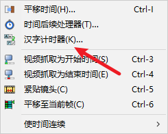

- 对于使用了振假名注音的日语歌词，则需要与**假名**对应;

  > [raw-data/GARNiDELiA/G.R.N.D/After glow - GARNiDELiA (547976278).ass](https://github.com/ranhengzhang/amll-ttml-db-raw-data/blob/main/raw-data/GARNiDELiA/G.R.N.D/After%20glow%20-%20GARNiDELiA%20(547976278).ass#L31-L33)
  >
  > <pre lang="ass">
  > Dialogue: 0,0:00:20.00,0:00:24.26,orig,L__1 x-part:Verse,0,0,0,karaoke,{\ko24}あ{\ko44}ま{\ko47}{\ko30}り{\ko40}に{\ko83}<b>{\ko14}突|&lt;と{\ko10}#|つ{\ko16}然|ぜ{\ko14}#|ん</b>{\ko31}す{\ko29}ぎ{\ko44}て
  > Dialogue: 0,0:00:20.00,0:00:24.26,roma,____,0,0,0,,{\k24}a {\k44}ma {\k47}{\k30}ri {\k40}ni {\k83}{\k14}to {\k10}tsu {\k16}ze{\k14}n {\k31}su {\k29}gi {\k44}te
  > Dialogue: 0,0:00:20.00,0:00:24.26,ts,____,0,0,0,,太过突然
  > </pre>
  > 
  ><table border="1">
  > <tr>
  > <td><code>orig</code></td>
  > <td><kbd>あ</kbd></td><td><kbd>ま</kbd></td><td><kbd></kbd></td><td><kbd>り</kbd></td><td><kbd>に</kbd></td><td><kbd></kbd></td><td><b><kbd>突|&lt;と</kbd></b></td><td><b><kbd>#|つ</kbd></b></td><td><b><kbd>然|ぜ</kbd></b></td><td><b><kbd>#|ん</kbd></b></td><td><kbd>す</kbd></td><td><kbd>ぎ</kbd></td><td><kbd>て</kbd></td>
  > </tr>
  > <tr>
  > <td><code>roma</code></td>
  > <td><kbd>a·</kbd></td><td><kbd>ma·</kbd></td><td><kbd></kbd></td><td><kbd>ri·</kbd></td><td><kbd>ni·</kbd></td><td><kbd></kbd></td><td><b><kbd>to·</kbd></b></td><td><b><kbd>tsu·</kbd></b></td><td><b><kbd>ze</kbd></b></td><td><b><kbd>n·</kbd></b></td><td><kbd>su·</kbd></td><td><kbd>gi·</kbd></td><td><kbd>te</kbd></td>
  > </tr>
  > <tr>
  > <td><code>ts</code></td>
  > <td colspan="13"><kbd>太过突然</kbd></td>
  > </tr>
  > </table>


- 逐字翻译一般用于繁简中文之间的替换，并且导出后在翻译行，所以需要添加 `x-replace` 标记：

  > [raw-data/AGA/Ginadoll/圆 - AGA (406475388).ass](https://github.com/ranhengzhang/amll-ttml-db-raw-data/blob/main/raw-data/AGA/Ginadoll/%E5%9C%86%20-%20AGA%20(406475388).ass#L51-L53)
  >
  > <pre lang="ass">
  > Dialogue: 0,0:00:46.97,0:00:54.18,orig,L__7 x-part:Verse,0,0,0,,{\ko46}誰{\ko53}等{\ko44} {\ko54}等{\ko42} {\ko63}等{\ko37} {\ko35}等{\ko16}不{\ko16}{\ko30}到{\ko191}月{\ko94}圓
  > Dialogue: 0,0:00:46.97,0:00:54.18,roma,____ x-lang:zh-Latn-jyutping,0,0,0,,{\k46}seoi4 {\k53}dang2 {\k44}{\k54}dang2 {\k42}{\k63}dang2 {\k37}{\k35}dang2 {\k16}bat1 {\k16}{\k30}dou3 {\k191}jyut6 {\k94}jyun4
  > Dialogue: 0,0:00:46.97,0:00:54.18,ts,x-lang:zh-Hans <b>x-replace</b>,0,0,0,,{\k46}谁{\k53}等 {\k44}{\k54}等 {\k42}{\k63}等 {\k37}{\k35}等{\k16}不{\k16}{\k30}到{\k191}月{\k94}圆
  > </pre>
  >
  > <table border="1">
  > <tr>
  > <td><code>orig</code></td>
  > <td><kbd>誰</kbd></td><td><kbd>等</kbd></td><td><kbd>·</kbd></td><td><kbd>等</kbd></td><td><kbd>·</kbd></td><td><kbd>等</kbd></td><td><kbd>·</kbd></td><td><kbd>等</kbd></td><td><kbd>不</kbd></td><td><kbd></kbd></td><td><kbd>到</kbd></td><td><kbd>月</kbd></td><td><kbd>圓</kbd></td>
  > </tr>
  > <tr>
  > <td><code>roma</code></td>
  > <td><kbd>seoi4·</kbd></td><td><kbd>dang2·</kbd></td><td><kbd></kbd></td><td><kbd>dang2·</kbd></td><td><kbd></kbd></td><td><kbd>dang2·</kbd></td><td><kbd></kbd></td><td><kbd>dang2·</kbd></td><td><kbd>bat1·</kbd></td><td><kbd></kbd></td><td><kbd>dou3·</kbd></td><td><kbd>jyut6·</kbd></td><td><kbd>jyun4</kbd></td>
  > </tr>
  > <tr>
  > <td><code>ts</code></td>
  > <td><kbd>谁</kbd></td><td><kbd>等·</kbd></td><td><kbd></kbd></td><td><kbd>等·</kbd></td><td><kbd></kbd></td><td><kbd>等·</kbd></td><td><kbd></kbd></td><td><kbd>等</kbd></td><td><kbd>不</kbd></td><td><kbd></kbd></td><td><kbd>到</kbd></td><td><kbd>月</kbd></td><td><kbd>圆</kbd></td>
  > </tr>
  > </table>


#### 标记音节类型

ass2ttml 脚本使用内联标记（[inline-fx](https://aegi.vmoe.info/docs/3.2/Karaoke_inline-fx/)）进行单音节的特殊处理，目前支持以下标记：

- 合并标记：`{\-M}` 或 `{\-merge}`，表示与前一个**有内容的**音节合并（会将夹在中间的空格也合并）。常用于在日语中**前一个汉字只发一个音，并且和后面一个字/假名连读**或者**前一个假名和后一个只有一个音的汉字连读**的情况。

  > [raw-data/Ren Zotto/SUPER DUPER/SUPER DUPER - 樋口楓／Ren Zotto (2086058827).ass](https://github.com/ranhengzhang/amll-ttml-db-raw-data/blob/main/raw-data/Ren%20Zotto/SUPER%20DUPER/SUPER%20DUPER%20-%20%E6%A8%8B%E5%8F%A3%E6%A5%93%EF%BC%8FRen%20Zotto%20(2086058827).ass#L123-L125)
  >
  > <pre lang="ass">
  > Dialogue: 0,0:01:45.67,0:01:50.84,orig,L_31,0,0,0,karaoke,{\ko17}今|&lt;い{\ko16}#|ま{\ko32}きっ{\ko29}と {\ko15}光|&lt;ひ{\ko7}#|{\ko22}#|か{\ko29}#|り{\ko24}を{\ko24}狙|&lt;ね{\ko22}#|ら<b>{\ko12}い{\ko13}{\-M}撃|&lt;う</b>{\ko16}ち {\ko22}DA{\ko13}SH{\ko0}{\-Z}!!{\ko20} {\ko8}個|&lt;こ{\ko27}性|せ{\ko6}#|い{\ko23}の{\ko35}解|&lt;かい{\ko85}放|ほう
  > Dialogue: 0,0:01:45.67,0:01:50.84,roma,____,0,0,0,karaoke,{\k17}i {\k16}ma {\k32}ki t{\k29}to {\k15}hi {\k7}{\k22}ka {\k29}ri {\k24}o {\k24}ne {\k22}ra {\k12}i {\k13}u {\k16}chi {\k22}da{\k13}sh {\k0}{\k20}{\k8}ko {\k27}se {\k6}i {\k23}no {\k35}ka i {\k85}ho u
  > Dialogue: 0,0:01:45.67,0:01:50.84,ts,____,0,0,0,karaoke,此刻定将瞄准光芒精准射击 全力冲刺！！解放个性
  > </pre>
  >
  > `{\ko12}い{\ko13}撃|<う` 部分变为长音，但是如果标记为 `{\ko35}い撃|<う` 则会在应用模板后导致 furi 行错位（「い<ruby>撃<rt>う</rt></ruby>」变为「<ruby>い撃<rt>う</rt></ruby>」），因此使用合并标记 `{\ko12}い{\ko13}{\-M}撃|<う`，使用脚本导出后的结果为：
  >
  > ```xml
  > <span begin="03:49.320" end="03:49.730">に行</span>
  > ```
  >
  > [raw-data/GARNiDELiA/Violet Cry/LIFE - GARNiDELiA (109493975).ass](https://github.com/ranhengzhang/amll-ttml-db-raw-data/blob/main/raw-data/GARNiDELiA/Violet%20Cry/LIFE%20-%20GARNiDELiA%20(109493975).ass#L46-L48)
  >
  > <pre lang="ass">
  > Dialogue: 0,0:00:35.37,0:00:40.10,orig,L__5,0,0,0,karaoke,{\ko21}容|&lt;よう{\ko18}赦|しゃ<b>{\ko14}無|&lt;な{\ko7}{\-M}い</b>{\ko13}現|&lt;げ{\ko22}#|ん{\ko18}実|じ{\ko31}#|つ{\ko10}に{\ko6}踏|&lt;ふ{\ko51}み{\ko46}に{\ko53}じ{\ko37}ら{\ko69}れ{\ko9}{\ko19}て{\ko29}も
  > Dialogue: 0,0:00:35.37,0:00:40.10,roma,____,0,0,0,karaoke,{\k21}yo u {\k18}sha {\k14}na {\k7}i {\k13}ge{\k22}n {\k18}ji {\k31}tsu {\k10}ni {\k6}fu {\k51}mi {\k46}ni {\k53}ji {\k37}ra {\k69}re {\k9}{\k19}te {\k29}mo
  > Dialogue: 0,0:00:35.37,0:00:40.10,ts,____,0,0,0,karaoke,即便被残酷现实无情践踏
  > </pre>
  >
  > 同理，此处 `{\ko14}無|<な{\ko7}い` 部分变长音，如果标记为 `{\ko21}無|<ない` 则会导致 furi 错位（「<ruby>無<rt>な</rt></ruby>い」变为「<ruby>無い<rt>な</rt></ruby>」），因此使用合并标记 `{\ko14}無|<な{\ko7}{\-M}い`，脚本导出结果为：
  >
  > ```xml
  > <span begin="00:35.746" end="00:35.956">無い</span>
  > ```
  
- 纯文本节点标记：`{\-T}` 或 `{\-text}`，表示导出为纯文本节点

  > [raw-data/ViCTiM/ゼロサム・ゲーム  ノン・ゼロサム・ゲーム/ポイズン・アップル・ジュース - ViCTiM (245588294).ass](https://github.com/ranhengzhang/amll-ttml-db-raw-data/blob/main/raw-data/ViCTiM/%E3%82%BC%E3%83%AD%E3%82%B5%E3%83%A0%E3%83%BB%E3%82%B2%E3%83%BC%E3%83%A0%20%20%E3%83%8E%E3%83%B3%E3%83%BB%E3%82%BC%E3%83%AD%E3%82%B5%E3%83%A0%E3%83%BB%E3%82%B2%E3%83%BC%E3%83%A0/%E3%83%9D%E3%82%A4%E3%82%BA%E3%83%B3%E3%83%BB%E3%82%A2%E3%83%83%E3%83%97%E3%83%AB%E3%83%BB%E3%82%B8%E3%83%A5%E3%83%BC%E3%82%B9%20-%20ViCTiM%20(245588294).ass#L224)
  >
  > <pre lang="ass">
  > {\ko21}僕|&lt;ぼ{\ko50}#|く{\ko22}ら{\ko27}か{\ko46}ら{\ko25}{\ko27}プ|&lt;p{\ko43}レ|re{\ko33}ゼ|se{\ko18}ン|n{\ko92}ト|t{\ko0} {\ko197}フォー|&lt;for{\ko0\-Z}・{\ko75}ユー|&lt;you<mark><b>{\ko0\-T}💀</b></mark>
  > </pre>
  >专辑歌词本中，此行歌词的末尾附上了一个 Emoji，但是这个 Emoji 并不占用任何行时间，并且不好应用逐字渐变，则使用纯文本标记使其常亮，该行导出结果为：
  >
  > <pre lang="xml">
  >&lt;p begin=&quot;03:47.480&quot; end=&quot;03:54.240&quot; ttm:agent=&quot;v1&quot; itunes:key=&quot;L50&quot;&gt;&lt;span begin=&quot;03:47.480&quot; end=&quot;03:48.190&quot;&gt;僕&lt;/span&gt;&lt;span begin=&quot;03:48.190&quot; end=&quot;03:48.410&quot;&gt;ら&lt;/span&gt;&lt;span begin=&quot;03:48.410&quot; end=&quot;03:48.680&quot;&gt;か&lt;/span&gt;&lt;span begin=&quot;03:48.680&quot; end=&quot;03:49.140&quot;&gt;ら&lt;/span&gt;&lt;span begin=&quot;03:49.390&quot; end=&quot;03:49.660&quot;&gt;プ&lt;/span&gt;&lt;span begin=&quot;03:49.660&quot; end=&quot;03:50.090&quot;&gt;レ&lt;/span&gt;&lt;span begin=&quot;03:50.090&quot; end=&quot;03:50.420&quot;&gt;ゼ&lt;/span&gt;&lt;span begin=&quot;03:50.420&quot; end=&quot;03:50.600&quot;&gt;ン&lt;/span&gt;&lt;span begin=&quot;03:50.600&quot; end=&quot;03:51.520&quot;&gt;ト&lt;/span&gt;&lt;span begin=&quot;03:51.520&quot; end=&quot;03:51.525&quot;&gt; &lt;/span&gt;&lt;span begin=&quot;03:51.520&quot; end=&quot;03:53.490&quot;&gt;フォー&lt;/span&gt;&lt;span begin=&quot;03:53.490&quot; end=&quot;03:53.495&quot;&gt;・&lt;/span&gt;&lt;span begin=&quot;03:53.490&quot; end=&quot;03:54.240&quot;&gt;ユー&lt;/span&gt;<mark><b>💀</b></mark>&lt;/p&gt;
  > </pre>
  
- 零时间节点标记：`{\-Z}` 或 `{\-zero}`，表示目标在导出时持续时间应为 0（*为了保持兼容性，插件在导出时会将所有持续时间为 0 并且不会合并的非文本节点持续时间设置为 5 ms，因此零时标记实际上会设置为 5 ms*）

  > [raw-data/Evra/闪烁/闪烁 - Evra (2618159304).ass](https://github.com/ranhengzhang/amll-ttml-db-raw-data/blob/main/raw-data/Evra/%E9%97%AA%E7%83%81/%E9%97%AA%E7%83%81%20-%20Evra%20(2618159304).ass#L55)
  >
  > <pre lang="ass">
  > <b>{\kf0\-Z}“</b>{\kf20}睡{\kf6}不{\kf21}着{\kf22}吗<b>{\kf0\-Z}？</b>{\kf141}{\kf10}没{\kf17}关{\kf29}系<b>{\kf0\-Z}，</b>{\kf99}{\kf11}因{\kf42}为<b>{\kf0\-Z}”</b>
  > </pre>
  >
  > 这里的「“」「”」「？」和「，」如果原样导出的话会触发常亮，因此使用零时间标记，导出结果如下：
  >
  > <pre lang="xml">
  > &lt;p begin=&quot;1:43.080&quot; end=&quot;1:47.260&quot; itunes:key=&quot;L29&quot; ttm:agent=&quot;v1&quot;&gt;&lt;span begin=&quot;1:43.075&quot; end=&quot;1:43.080&quot;&gt;“&lt;/span&gt;&lt;span begin=&quot;1:43.080&quot; end=&quot;1:43.280&quot;&gt;睡&lt;/span&gt;&lt;span begin=&quot;1:43.280&quot; end=&quot;1:43.340&quot;&gt;不&lt;/span&gt;&lt;span begin=&quot;1:43.340&quot; end=&quot;1:43.550&quot;&gt;着&lt;/span&gt;&lt;span begin=&quot;1:43.550&quot; end=&quot;1:43.770&quot;&gt;吗&lt;/span&gt;<b>&lt;span begin=&quot;1:43.770&quot; end=&quot;1:43.775&quot;&gt;？&lt;/span&gt;</b>&lt;span begin=&quot;1:45.180&quot; end=&quot;1:45.280&quot;&gt;没&lt;/span&gt;&lt;span begin=&quot;1:45.280&quot; end=&quot;1:45.450&quot;&gt;关&lt;/span&gt;&lt;span begin=&quot;1:45.450&quot; end=&quot;1:45.740&quot;&gt;系&lt;/span&gt;<b>&lt;span begin=&quot;1:45.740&quot; end=&quot;1:45.745&quot;&gt;，&lt;/span&gt;</b>&lt;span begin=&quot;1:46.730&quot; end=&quot;1:46.840&quot;&gt;因&lt;/span&gt;&lt;span begin=&quot;1:46.840&quot; end=&quot;1:47.260&quot;&gt;为&lt;/span&gt;&lt;span begin=&quot;1:47.260&quot; end=&quot;1:47.265&quot;&gt;”&lt;/span&gt;&lt;/p&gt;
  > </pre>

#### 输出为 TTML

##### 输出之前

在输出之前，需要将行进行一次排序，才能进行正常的输出，可以使用 Aegisub 自带的行排序进行操作。具体为 ①样式名称 ②说话人 ③开始时间。（有时可能还需要选中特殊的部分按结束时间排序）

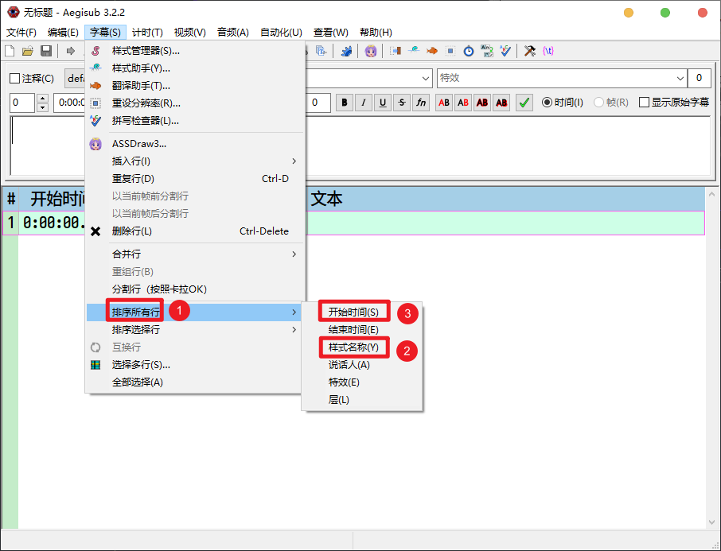

对于日语来说，最好用 [fix-furi.lua](https://github.com/ranhengzhang/amll-ttml-db-raw-data/blob/main/aegisub/fix-furi.lua) 脚本处理一次，将注音断掉的部分衔接。

> [raw-data/GARNiDELiA/Error/Error - GARNiDELiA (532776437).ass](https://github.com/ranhengzhang/amll-ttml-db-raw-data/blob/main/raw-data/GARNiDELiA/Error/Error%20-%20GARNiDELiA%20(532776437).ass#L69)
>
> **处理前**
>
> <pre lang="ass">
> {\ko39}結|&lt;け{\ko29}#|っ<b>{\ko8}</b>{\ko77}局|きょ<b>{\ko6}</b>{\ko29}#|く{\ko13}誰|&lt;だ{\ko24}#|れ{\ko12}に{\ko51}も{\ko27}{\ko33}わ{\ko8}{\ko38}か{\ko40}り{\ko20}は{\ko17}し{\ko65}な{\ko16}い
> </pre>
>**处理后**
>
> <pre lang="ass">
>{\ko39}結|&lt;け{\ko29}#|っ<b>{\ko8}|</b>{\ko77}局|きょ<b>{\ko6}#|</b>{\ko29}#|く{\ko13}誰|&lt;だ{\ko24}#|れ{\ko12}に{\ko51}も{\ko27}{\ko33}わ{\ko8}{\ko38}か{\ko40}り{\ko20}は{\ko17}し{\ko65}な{\ko16}い
> </pre>

如果你使用的是日语，或者添加了逐字音译/翻译，建议使用 [check.ass](https://github.com/ranhengzhang/amll-ttml-db-raw-data/blob/main/subtitles/check.ass) 中的模板行进行一次核验，用于检查日语中振假名对应关系是否正确、逐字翻译/音译是否与主行的时间轴一致。

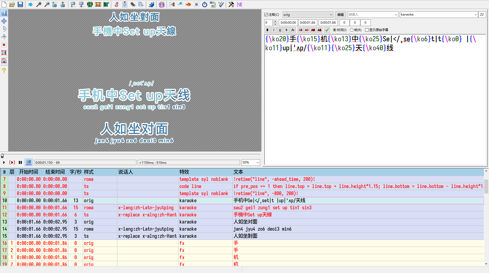

##### 填写标签

点击自动化脚本进入导出页面

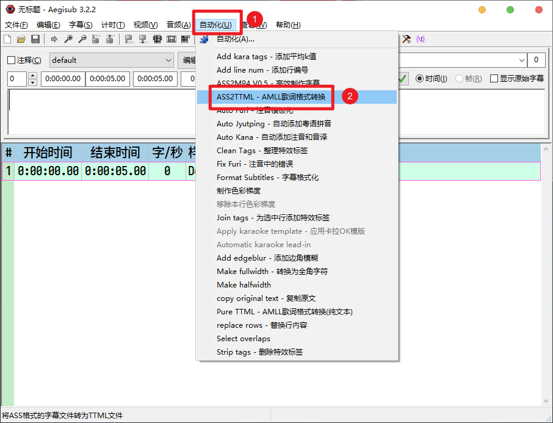

在导出页面中，填写各个标签，一个标签中的不同条目可以使用英文字符中的 `,/&` 三种字符进行分割

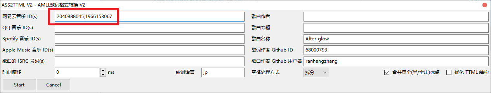

> **关于 Github ID 和 Github 用户名**
>
> 如果不想每次都输入一次这两个条目，打开 lua 脚本，搜索 `name = "ttmlAuthorGithubs"`，在该对象的最后添加一行 `value='id'`，`name = "ttmlAuthorGithubLogins"` 搜索后同理
>
> 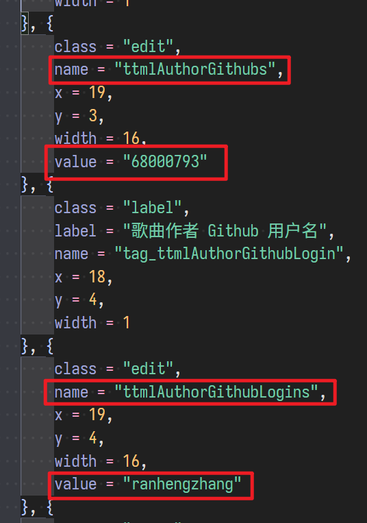

##### 选择优化

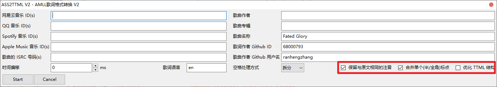

其中：

- 「空格处理」有「不处理」、「合并」、「拆分」三种选项，「合并」选项会将空格合并到前一个音节的末尾，「拆分」选项则会将音节内部首/尾的空格放在音节前/后；
- 「保留与原文相同的注音」关闭时，如果原文和逐字翻译/音译相同（不区分大小写，忽略首尾空格），则该音节的逐字音译/翻译输出为空音节；
- 「合并单个标点」打开时会将单个标点符号合并到前一个音节中；（*如果是成对符号的前个则会向后合并*）
- 「优化 TTML 结构」打开时会将以下两种音节转换为纯文本节点：
  - 纯空格组成的音节；
  - 持续时间为 0 的音节。

##### 转换完成

转换完成后，将显示如下界面：

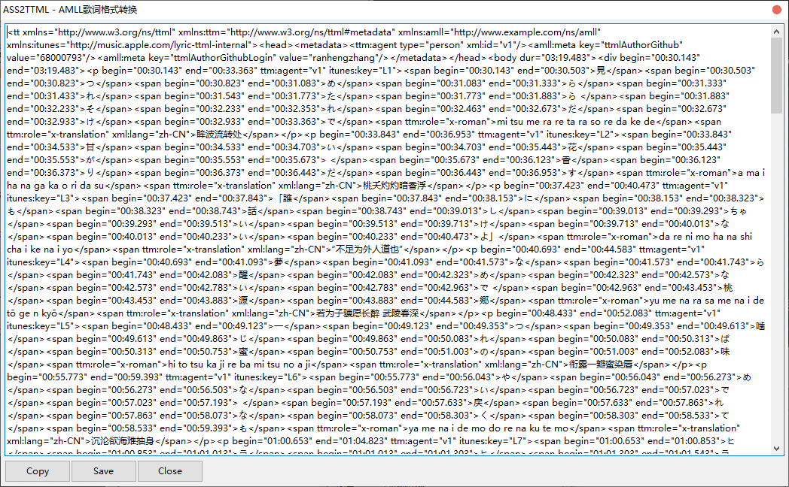

<kbd>Copy</kbd> 按钮将直接复制 ttml 文件内容到剪贴板，其中 <kbd>Save</kbd> 按钮会将 ttml 内容保存为一个 `*.word.ttml` 文件（为了与旧版 `*.ttml` 区分）。如果希望预设一个文件名，可以在「脚本配置」中设置标题，标题将作为导出文件时的默认文件名，每次打开之后从第二次保存开始会默认使用上次保存结果。

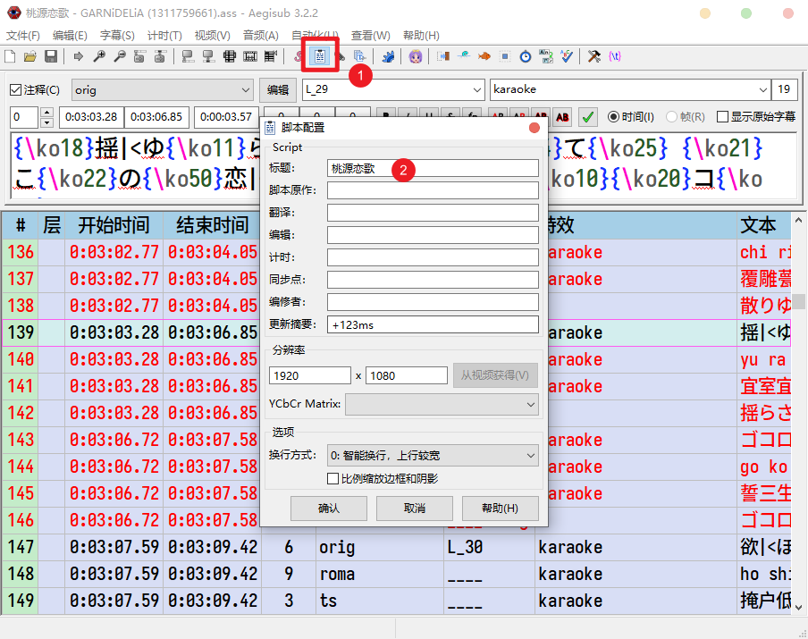

## ass2ttml.lua

> [!CAUTION]
>
> 旧版丨不支持逐字翻译/音译丨仅修复 bug 或随 v2 更新

<div align="center"><a href="https://github.com/ranhengzhang/amll-ttml-db-raw-data/blob/main/aegisub/ass2ttml-3.2.lua"></a> <a href="https://github.com/ranhengzhang/amll-ttml-db-raw-data/blob/main/aegisub/ass2ttml-3.4.lua"></a> <a href="https://aegi.vmoe.info/docs/3.2/Automation/Lua/"></a> <a href="https://help.apple.com/itc/videoaudioassetguide/#/itc0f14fecdd"></a></div>

> [!NOTE]
>
> 用于在 Aegisub 应用内将 ass 字幕文件直接导出可用 ttml 文件的自动化脚本。
>
> *ttml 转 ass 或其它格式戳这里 => [ranhengzhang/ttml-translater](https://github.com/ranhengzhang/ttml-translater)*

### 如何安装

1. 下载好 lua 脚本后，打开自动化页面
    
2. 随便选择一个脚本，点击「显示信息」
    
3. 在文件资源管理器中打开显示的完整路径（**只需要打开到「autoload」目录**）
    
4. 将 lua 脚本放入「autoload」目录中，重新打开 Aegisub 即可在自动化列表中看见
    
    

### 如何使用

该自动化脚本需要按照特定格式和标记导出正确 ttml 内容

#### 标记行类型

该脚本不会区分 Dialog 行和 Comment 行，并且只会处理「样式」为 `orig` `ts` `roma` 同时「特效」为**空**或「**karaoke**」的部分


其中，`orig` 表示原文行，`ts` 表示翻译行，`roma` 表示音译行。根据这个特性，在打轴时，对于一些不希望写入 ttml 中但是又想保留的行（例如歌曲信息），可以使用不会处理的标签进行标记


#### 标记行角色

在 ttml 中可以将行标记为**对唱**、**背景声**与**翻译语言**，在 ass 字幕中可以在说话人一栏填写相应标记进行设置，具体如下：

- `x-bg`：背景声行
- `x-duet`、`x-solo` 或 `x-anti`：对唱行
- `x-chor`：合唱行
- `x-mark*`：用于特定标记，但不输出到 ttml 文件中
- `x-lang:*`：用于在 ts 行中标记翻译对应的语言。**(默认为 `zh-CN`)**
- `x-part:*`：用于标记新的部分的开始


> **合唱行的处理**
>
> 当上下两行时间轴相同但是 role 不同时，使用合唱行进行标记。输出时会自动输出两行。
>
> 以下是使用 `x-chor` 进行标记的例子：
>
> 
>
> 使用脚本导出为 ttml 后，被标记为合唱的部分格式化之后为：
>
> ```xml
> <p begin="01:22.780" end="01:30.600" ttm:agent="v1" itunes:key="L10">
>  <span begin="01:22.780" end="01:23.860">让</span>
>  <span begin="01:23.860" end="01:24.710">我</span>
>  <span begin="01:24.710" end="01:25.010">最</span>
>  <span begin="01:25.010" end="01:25.540">后</span>
>  <span begin="01:25.540" end="01:25.920">一</span>
>  <span begin="01:25.920" end="01:26.240">次</span>
>  <span begin="01:26.240" end="01:27.760">想</span>
>  <span begin="01:27.760" end="01:30.600">你</span>
> </p>
> <p begin="01:22.780" end="01:30.600" ttm:agent="v2" itunes:key="L11">
>  <span begin="01:22.780" end="01:23.860">让</span>
>  <span begin="01:23.860" end="01:24.710">我</span>
>  <span begin="01:24.710" end="01:25.010">最</span>
>  <span begin="01:25.010" end="01:25.540">后</span>
>  <span begin="01:25.540" end="01:25.920">一</span>
>  <span begin="01:25.920" end="01:26.240">次</span>
>  <span begin="01:26.240" end="01:27.760">想</span>
>  <span begin="01:27.760" end="01:30.600">你</span>
> </p>
> ```
>
> 可以配合 `x-bg` 使用，此时输出的不再是对唱的两行，而是时间轴完全相同的主行和背景行
>
> 
>
> ```xml
> <div begin="02:59.877" end="00:00.000" itunes:song-part="Hook">
>  <p begin="02:59.877" end="03:05.857" ttm:agent="v1" itunes:key="L40">
>   <span begin="02:59.877" end="03:00.157">An</span>
>   <span begin="03:00.157" end="03:00.437">gel</span>
>   <span begin="03:00.437" end="03:00.607">s o</span>
>   <span begin="03:00.607" end="03:01.197">f fi</span>
>   <span begin="03:01.197" end="03:01.967">re</span>
>   <span begin="03:01.967" end="03:01.972">,</span>
>   <span begin="03:01.967" end="03:02.567"> </span>
>   <span begin="03:02.567" end="03:02.717">di</span>
>   <span begin="03:02.717" end="03:03.137">vi</span>
>   <span begin="03:03.137" end="03:03.627">ne</span>
>   <span begin="03:03.627" end="03:03.632">,</span>
>   <span begin="03:03.627" end="03:03.627"> </span>
>   <span begin="03:03.627" end="03:03.797">di</span>
>   <span begin="03:03.797" end="03:04.097">vi</span>
>   <span begin="03:04.097" end="03:04.687">ne</span>
>   <span begin="03:04.687" end="03:04.687"> </span>
>   <span begin="03:04.687" end="03:04.877">di</span>
>   <span begin="03:04.877" end="03:05.217">vi</span>
>   <span begin="03:05.217" end="03:05.857">ne</span>
>   <span ttm:role="x-translation" xml:lang="zh-CN">烈焰天使 神圣无上</span>
>   <span ttm:role="x-bg" begin="02:59.877" end="03:05.857">
>    <span begin="02:59.877" end="03:00.157">(An</span>
>    <span begin="03:00.157" end="03:00.437">gel</span>
>    <span begin="03:00.437" end="03:00.607">s o</span>
>    <span begin="03:00.607" end="03:01.197">f fi</span>
>    <span begin="03:01.197" end="03:01.967">re</span>
>    <span begin="03:01.967" end="03:01.972">,</span>
>    <span begin="03:01.967" end="03:02.567"> </span>
>    <span begin="03:02.567" end="03:02.717">di</span>
>    <span begin="03:02.717" end="03:03.137">vi</span>
>    <span begin="03:03.137" end="03:03.627">ne</span>
>    <span begin="03:03.627" end="03:03.632">,</span>
>    <span begin="03:03.627" end="03:03.627"> </span>
>    <span begin="03:03.627" end="03:03.797">di</span>
>    <span begin="03:03.797" end="03:04.097">vi</span>
>    <span begin="03:04.097" end="03:04.687">ne</span>
>    <span begin="03:04.687" end="03:04.687"> </span>
>    <span begin="03:04.687" end="03:04.877">di</span>
>    <span begin="03:04.877" end="03:05.217">vi</span>
>    <span begin="03:05.217" end="03:05.857">ne)</span>
>    <span ttm:role="x-translation" xml:lang="zh-CN">烈焰天使 神圣无上</span>
>   </span>
>  </p>
> </div>
> ```

> **关于多语言翻译**
>
> 以 MARiA 的《智子》为例，这首**中文**歌在官方 MV 中给出了**英文和日文**的翻译，因此在 ass 文件中，需要标记两个 ts 行。而为了区分这两种语言，就需要使用 `x-lang` 标记指名翻译语言。
>
> 格式为 `x-lang:<languagecode>-<regioncode>`，具体有哪些类型以 amll player 开发者未来给出的为准，目前暂时遵循 **RFC 1766** 标准。
>
> - **语言代码** (ISO 639-1）：两个小写字母 (如 `zh` 表示中文，`en` 表示英语)
> - **地区代码** (ISO 3166-1）：两个大写字母 (如 `CN` 表示中国，`US` 表示美国)
>
> 以下是使用 `x-lang` 标记两种不同语言翻译的例子：
>
> 

> **关于 `x-mark`**
>
> 这个标记一般用于统计一些特殊情况，譬如在 ttml 输出完成后，我需要检查一些行的输出情况，则可以为这些行打上 `x-mark` 标记。
>
> 以下是使用 `x-mark` 标记**使用了需要声明翻译来源**的行的例子：
>
> 
>
> 
>
> `x-mark` 标记会根据后缀不同进行分组，譬如其中一些行标记了 `x-mark-a`，另一些标记了 `x-mark-b`，那么在最终统计中会分别进行输出。

> **关于 songPart**
>
> 建议依照 [Apple Music 的建议](https://help.apple.com/itc/videoaudioassetguide/#/itcd7579a252:~:text=%E7%A0%81%E7%9A%84%E8%AF%B4%E6%98%8E%E3%80%82-,%E6%AD%8C%E8%AF%8D%E7%9A%84%20Apple%20%E6%89%A9%E5%B1%95,-%E6%AD%8C%E6%9B%B2%E7%BB%84%E6%88%90%E9%83%A8%E5%88%86)进行标记：
>
> - Verse（主歌）
> - Chorus（副歌）
> - PreChorus（预副歌）
> - Bridge（桥段）
> - Intro（前奏）
> - Outro（尾奏）
> - Refrain（叠句）
> - Instrumental（器乐）
> - Hook（钩子）
>
> 可以使用 [set-part.lua](https://github.com/ranhengzhang/amll-ttml-db-raw-data/blob/main/aegisub/set-part.lua) 脚本快速设置。

#### 标记音节类型

ass2ttml 脚本使用内联标记（[inline-fx](https://aegi.vmoe.info/docs/3.2/Karaoke_inline-fx/)）进行单音节的特殊处理，目前支持以下标记：

- 合并标记：`{\-M}` 或 `{\-merge}`，表示与前一个**有内容的**音节合并（会将夹在中间的空格也合并）。常用于在日语中，前一个汉字只发一个音，并且和后面一个字/假名连读

  > **样例**
  >
  > ```ass
  > {\ko19}何|<な{\ko8}#|ん{\ko22}度|<ど{\ko24}で{\ko44}も{\ko27}{\ko12}生|<う{\ko13}ま{\ko22}れ{\ko22}変|<か{\ko23}わ{\ko38}っ{\ko12}{\ko35}て{\ko12} {\ko7}あ{\ko8}の{\ko32}日|<ひ{\ko26}の{\ko18}{\ko16}君|<き{\ko36}#|み{\ko23}に{\ko21}{\ko24}逢|<あ{\ko46}い{\ko18}に{\ko23}{\-M}行|<い{\ko47}く{\ko252}よ
  > ```
  >
  > `{\ko18}に{\ko23}行|<い` 部分变为长音，但是如果标记为 `{\ko41}に行|<い` 则会在应用模板后导致 furi 行错位（「に<ruby>行<rt>い</rt></ruby>」变为「<ruby>に行<rt>い</rt></ruby>」），因此使用合并标记 `{\ko18}に{\ko23\-M}行|<い`，使用脚本导出后的结果为：
  >
  > ```xml
  > <span begin="03:49.320" end="03:49.730">に行</span>
  > ```

- 纯文本节点标记：`{\-T}` 或 `{\-text}`，表示导出为纯文本节点

  > **样例**
  >
  > ```ass
  > {\ko21}僕|<ぼ{\ko50}#|く{\ko22}ら{\ko27}か{\ko46}ら{\ko25}{\ko27}プ{\ko43}レ{\ko33}ゼ{\ko18}ン{\ko92}ト {\ko197}フォー{\ko0}・{\ko75}ユー{\ko0}{\T}💀
  > ```
  >
  > 专辑歌词本中，此行歌词的末尾附上了一个 Emoji，但是这个 Emoji 并不占用任何行时间，并且不好应用逐字渐变，则使用纯文本标记使其常亮，该行导出结果为：
  >
  > ```xml
  > <p begin="03:47.480" end="03:54.240" ttm:agent="v1" itunes:key="L50"><span begin="03:47.480" end="03:48.190">僕</span><span begin="03:48.190" end="03:48.410">ら</span><span begin="03:48.410" end="03:48.680">か</span><span begin="03:48.680" end="03:49.140">ら</span><span begin="03:49.390" end="03:49.660">プ</span><span begin="03:49.660" end="03:50.090">レ</span><span begin="03:50.090" end="03:50.420">ゼ</span><span begin="03:50.420" end="03:50.600">ン</span><span begin="03:50.600" end="03:51.520">ト</span><span begin="03:51.520" end="03:51.520"> </span><span begin="03:51.520" end="03:53.490">フォー・</span><span begin="03:53.490" end="03:54.240">ユー</span>💀<span ttm:role="x-roman">bo ku ra ka ra present for you</span><span ttm:role="x-translation" xml:lang="zh-CN">我们献上这份赠礼 专属于你</span></p>
  > ```

- 零时间节点标记：`{\-Z}` 或 `{\-zero}`，表示目标在导出时持续时间应为 0（*为了保持兼容性，插件在导出时会将所有持续时间为 0 并且不会合并的非文本节点持续时间设置为 5 ms*）

  > **样例**
  >
  > ```ass
  > {\kf0}“{\kf20}睡{\kf6}不{\kf21}着{\kf22}吗{\kf141\-Z}？{\kf10}没{\kf17}关{\kf29}系{\kf99}{\-Z}，{\kf11}因{\kf42}为{\kf0}”
  > ```
  >
  > 这里的「？」和「，」如果原样导出的话会触发高亮，因此使用零时间标记，导出结果如下：
  >
  > ```xml
  > <p begin="01:43.080" end="01:47.260" ttm:agent="v1" itunes:key="L29"><span begin="01:43.080" end="01:43.280">“睡</span><span begin="01:43.280" end="01:43.340">不</span><span begin="01:43.340" end="01:43.550">着</span><span begin="01:43.550" end="01:43.770">吗</span><span begin="01:43.770" end="01:43.775">？</span><span begin="01:45.180" end="01:45.280">没</span><span begin="01:45.280" end="01:45.450">关</span><span begin="01:45.450" end="01:45.740">系</span><span begin="01:45.740" end="01:45.745">，</span><span begin="01:46.730" end="01:46.840">因</span><span begin="01:46.840" end="01:47.260">为”</span></p>
  > ```

#### 输出为 TTML

##### 输出之前

在输出之前，需要将行进行一次排序，才能进行正常的输出，可以使用 Aegisub 自带的行排序进行操作。具体为 ①样式名称 ②说话人 ③开始时间。（有时可能还需要选中特殊的部分按结束时间排序）


对于日语来说，最好用 [fix-furi.lua](https://github.com/ranhengzhang/amll-ttml-db-raw-data/blob/main/aegisub/fix-furi.lua) 脚本处理一次，将注音断掉的部分衔接。并且使用 [check.ass](https://github.com/ranhengzhang/amll-ttml-db-raw-data/blob/main/check.ass) 中的模板行进行一次核验。

> **处理前**
>
> ```ass
> {\ko13}僕|<ぼ{\ko8}{\ko24}#|く{\ko15}ら{\ko26}は{\ko7}{\ko19}こん{\ko29}な{\ko11}こ{\ko23}と{\ko12}し{\ko11}た{\ko26}か{\ko12}っ{\ko22}た{\ko17}の{\ko30}か{\ko67}な
> ```
>
> **处理后**
>
> ```ass
> {\ko13}僕|<ぼ{\ko8}#|{\ko24}#|く{\ko15}ら{\ko26}は{\ko7}{\ko19}こん{\ko29}な{\ko11}こ{\ko23}と{\ko12}し{\ko11}た{\ko26}か{\ko12}っ{\ko22}た{\ko17}の{\ko30}か{\ko67}な
> ```

##### 填写标签

点击自动化脚本进入导出页面


在导出页面中，填写各个标签，一个标签中的不同条目可以使用英文字符中的 `,/&` 三种字符进行分割

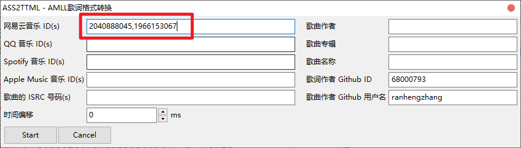

> **关于 Github ID 和 Github 用户名**
>
> 如果不想每次都输入一次这两个条目，打开 lua 脚本，搜索 `name = "ttmlAuthorGithubs"`，在该对象的最后添加一行 `value='id'`，`name = "ttmlAuthorGithubLogins"` 搜索后同理
>
> 

> **关于 `offset`**
>
> 如果你在使用 CD 提取的音频进行打轴，那么需要提前与平台音源比对进行一次偏移校准
>
> 
>
> 
>
> 
>
> 上面的例子中，我们得知平台音源相比于 CD 音源前面多了 123 ms 的空白音频，因此 offset 为 +123 ms
>
> 
>
> 如果不想每次导出时都填写，可以打开「脚本配置」，将「更新摘要」设定为 `+123ms`，**该 ass 字幕**每次导出时都将自动设置 offset
>
> 

> [!TIP]
>
> 👉 [关于多个偏移值](https://github.com/ranhengzhang/amll-ttml-db-raw-data#:~:text=%E8%87%AA%E5%8A%A8%E8%AE%BE%E7%BD%AE%20offset%E3%80%82-,offset%20%E5%8F%AF%E4%BB%A5%E5%A1%AB%E5%86%99%E5%A4%9A%E4%B8%AA%E5%80%BC,-%EF%BC%8C%E4%BD%86%E8%AF%B7%E6%B3%A8%E6%84%8F)

##### 选择优化

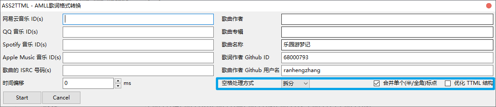

其中

- 「空格处理」有「不处理」、「合并」、「拆分」三种选项，「合并」选项会将空格合并到前一个音节的末尾，「拆分」选项则会将音节内部首/尾的空格放在音节前/后。
- 「合并单个标点」打开时会将单个标点符号合并到前一个音节中。（*如果是成对符号的前个则会向后合并*）
- 「优化 TTML 结构」打开时会将以下两种音节转换为纯文本节点：
  - 纯空格组成的音节
  - 持续时间为 0 的音节

##### 转换完成

转换完成后，将显示如下界面


<kbd>Copy</kbd> 按钮将直接复制 ttml 文件内容到剪贴板，其中 <kbd>Save</kbd> 按钮会将 ttml 内容保存为一个 .ttml 文件。如果希望预设一个文件名，可以在「脚本配置」中设置标题，标题将作为导出文件时的默认文件名。


### 附Ⅰ 关于 furi 及 karaoke templater

在对日语歌打轴时需要进行假名标记，并且会用到 karaoke 模板处理进行预览

```plaintext
Comment: 0,0:00:00.00,0:00:00.00,orig,,0,0,0,code once,pre_end_time=0; pre_pos=0;
Comment: 0,0:00:00.00,0:00:00.00,orig,,0,0,0,code line,if (line.start_time)-200 < (pre_end_time)+800 then line.pos=1-pre_pos; else line.pos=0; end; pre_end_time=line.end_time; pre_pos=line.pos; if line.pos == 1 then line.top = line.top - line.height*1.65; line.bottom = line.bottom - line.height*1.65; end;
Comment: 0,0:00:00.00,0:00:00.00,orig,,0,0,0,template furi noblank,!retime("line", -800, 200)!{\pos(!line.left+syl.center!,!line.top-200!)\k!($sstart/10)+80!\kf!($skdur)!\fad(200,200)}
Comment: 1,0:00:00.00,0:00:00.00,orig,,0,0,0,template syl noblank,!retime("line", -800, 200)!{\pos(!line.left+syl.center!,!line.bottom-200!)\k!($sstart/10)+80!\kf!($skdur)!\fad(200,200)}
Comment: 0,0:00:00.00,0:00:00.00,roma,,0,0,0,template line,!retime("line", -800, 200)!{\fad(200,200)}
Comment: 0,0:00:00.00,0:00:00.00,ts,,0,0,0,template line,!retime("line", -800, 200)!{\fad(200,200)}
Comment: 0,0:00:30.02,0:00:33.24,orig,L__1,0,0,0,karaoke,{\ko36}見|<み{\ko32}つ{\ko26}め{\ko25}ら{\ko10}れ{\ko11}{\ko23}た{\ko11}ら {\ko35}そ{\ko12}れ{\ko11}{\ko21}だ{\ko26}け{\ko43}で
Comment: 0,0:00:30.02,0:00:33.24,roma,____,0,0,0,karaoke,mi tsu me ra re ta ra so re da ke de
Comment: 0,0:00:30.02,0:00:33.24,ts,____,0,0,0,karaoke,眸波流转处
Comment: 0,0:00:30.02,0:00:33.24,tuck,____,0,0,0,,{\kf47}見{\kf22}つ{\kf29}め{\kf28}ら{\kf16}れ{\kf30}た{\kf12}ら {\kf34}そ{\kf17}れ{\kf26}だ{\kf24}け{\kf48}で
Comment: 0,0:00:33.72,0:00:36.83,orig,L__2,0,0,0,karaoke,{\ko45}甘|<あ{\ko24}#|ま{\ko17}い{\ko50}花|<は{\ko24}#|な{\ko11}が{\ko12} {\ko23}香|<か{\ko22}#|お{\ko25}り{\ko7}だ{\ko51}す
Comment: 0,0:00:33.72,0:00:36.83,roma,____,0,0,0,karaoke,a ma i ha na ga ka o ri da su
Comment: 0,0:00:33.72,0:00:36.83,ts,____,0,0,0,karaoke,桃夭灼灼暗香浮
Comment: 0,0:00:33.72,0:00:36.83,tuck,____,0,0,0,,{\kf73}甘{\kf18}い{\kf71}花{\kf18}が {\kf48}香{\kf29}り{\kf10}だ{\kf35}す
```

该脚本在导出时，只会导出 `orig` 中被处理后的内容，比如 `{\ko45}甘|<あ{\ko24}#|ま{\ko17}い` 导出后会变为以下内容：

```plaintext
<span begin="00:33.843" end="00:34.533">甘</span>
<span begin="00:34.533" end="00:34.703">い</span>
```

而对于 karaoke templater 处理后的行。例如：

```plaintext
Dialogue: 1,0:00:32.92,0:00:37.03,orig,L__2,0,0,0,fx,{\pos(546.09375,658.8)\k80\kf69\fad(200,200)}甘
Dialogue: 1,0:00:32.92,0:00:37.03,orig,L__2,0,0,0,fx,{\pos(659.46875,658.8)\k149\kf17\fad(200,200)}い
Dialogue: 1,0:00:32.92,0:00:37.03,orig,L__2,0,0,0,fx,{\pos(772.84375,658.8)\k166\kf74\fad(200,200)}花
Dialogue: 1,0:00:32.92,0:00:37.03,orig,L__2,0,0,0,fx,{\pos(886.21875,658.8)\k240\kf11\fad(200,200)}が
Dialogue: 1,0:00:32.92,0:00:37.03,orig,L__2,0,0,0,fx,{\pos(1033.78125,658.8)\k263\kf45\fad(200,200)}香
Dialogue: 1,0:00:32.92,0:00:37.03,orig,L__2,0,0,0,fx,{\pos(1147.15625,658.8)\k308\kf25\fad(200,200)}り
Dialogue: 1,0:00:32.92,0:00:37.03,orig,L__2,0,0,0,fx,{\pos(1260.53125,658.8)\k333\kf7\fad(200,200)}だ
Dialogue: 1,0:00:32.92,0:00:37.03,orig,L__2,0,0,0,fx,{\pos(1373.90625,658.8)\k340\kf51\fad(200,200)}す
Dialogue: 0,0:00:32.92,0:00:37.03,orig-furigana,L__2,0,0,0,fx,{\pos(518.0390625,530.8)\k80\kf45\fad(200,200)}あ
Dialogue: 0,0:00:32.92,0:00:37.03,orig-furigana,L__2,0,0,0,fx,{\pos(574.1484375,530.8)\k125\kf24\fad(200,200)}ま
Dialogue: 0,0:00:32.92,0:00:37.03,orig-furigana,L__2,0,0,0,fx,{\pos(744.7890625,530.8)\k166\kf50\fad(200,200)}は
Dialogue: 0,0:00:32.92,0:00:37.03,orig-furigana,L__2,0,0,0,fx,{\pos(800.8984375,530.8)\k216\kf24\fad(200,200)}な
Dialogue: 0,0:00:32.92,0:00:37.03,orig-furigana,L__2,0,0,0,fx,{\pos(1005.7265625,530.8)\k263\kf23\fad(200,200)}か
Dialogue: 0,0:00:32.92,0:00:37.03,orig-furigana,L__2,0,0,0,fx,{\pos(1061.8359375,530.8)\k286\kf22\fad(200,200)}お
Dialogue: 0,0:00:32.92,0:00:37.03,roma,____,0,0,0,fx,{\fad(200,200)}a ma i ha na ga ka o ri da su
Dialogue: 0,0:00:32.92,0:00:37.03,ts,____,0,0,0,fx,{\fad(200,200)}桃夭灼灼暗香浮
```

由于「特效」列为 `fx`，因此不必担心影响导出内容

### 附Ⅱ 其它 Aegisub 插件和模板

- [](https://github.com/ranhengzhang/amll-ttml-db-raw-data/blob/main/check.ass)：时间轴核查模板
- [](https://github.com/ranhengzhang/amll-ttml-db-raw-data/blob/main/aegisub/add-num.lua)：标记行号脚本
- [](https://github.com/ranhengzhang/amll-ttml-db-raw-data/blob/main/aegisub/add-trans.lua)：快速添加翻译脚本
- [](https://github.com/ranhengzhang/amll-ttml-db-raw-data/blob/main/aegisub/fix-furi.lua)：修复断开标注脚本
- [](https://github.com/ranhengzhang/amll-ttml-db-raw-data/blob/main/aegisub/original-copy.lua)：复制原文脚本
- [](https://github.com/ranhengzhang/amll-ttml-db-raw-data/blob/main/aegisub/pure-amll.lua)：ttml 原样导出脚本
- [](https://github.com/ranhengzhang/amll-ttml-db-raw-data/blob/main/aegisub/replace-rows.lua)：替换行内容脚本
- [](https://github.com/ranhengzhang/amll-ttml-db-raw-data/blob/main/aegisub/reset-line.lua)：清除 fx 行并取消注释脚本
- [](https://github.com/ranhengzhang/amll-ttml-db-raw-data/blob/main/aegisub/set-part.lua)：预设 songPart 设置脚本
- [](https://github.com/ranhengzhang/amll-ttml-db-raw-data/blob/main/aegisub/add-tag.lua)：批量添加 TTML 标记脚本

## 许可声明

本仓库的不同部分适用不同的许可证：

| 目录/文件 | 许可证 | 说明 |
|-----------|--------|------|
| 根目录 `LICENSE`（CC0 1.0）覆盖的范围 | CC0 1.0 Universal | `lyrics/`、`raw-data/`、`assets/`、`am-lyrics/` 等歌词数据文件 |
| [`aegisub/`](./aegisub/LICENSE) | GNU GPLv3 | Aegisub 自动化脚本（`.lua`） |
| [`subtitles/`](./subtitles/LICENSE) | GNU GPLv3 | Aegisub 字幕模板文件（`.ass`） |

> [!NOTE]
>
> `aegisub/` 与 `subtitles/` 目录下的文件自提交 `ddca9a082` 之后适用 GPLv3 协议，保留版权。在此之前的版本仍受 CC0 协议约束。