# Aegisub 打轴简易教程

> [!IMPORTANT]
>
> 当前页面仅介绍需要用到的部分，详细了解请戳 [官方文档](https://aegisub.org)。

## 认识界面

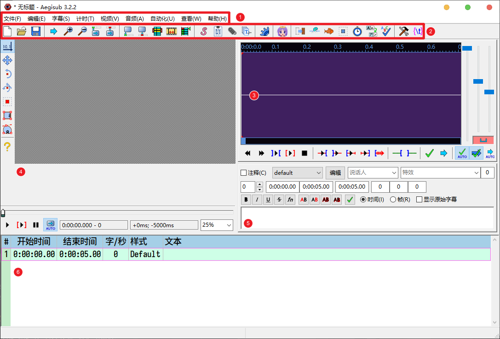

1. 菜单栏
1. 工具栏
1. 音频区域
1. 视频区域
1. 文件编辑区域
1. 行选择区域

## 获取歌词

> [!TIP]
>
> 歌词有很多种方式获取，这里只介绍常用的两种。

### 使用 LDDC 下载

1. 在 [chenmozhijin/LDDC](https://github.com/chenmozhijin/LDDC) 中选择 ASS 格式；
   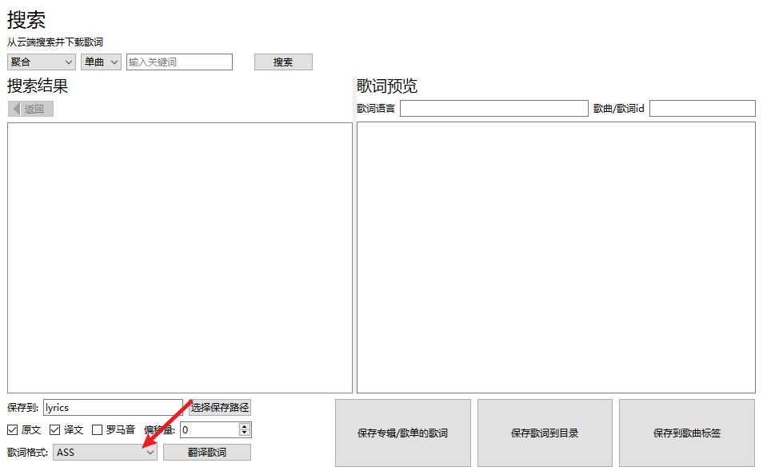
1. 选择目标歌曲并保存到本地。
   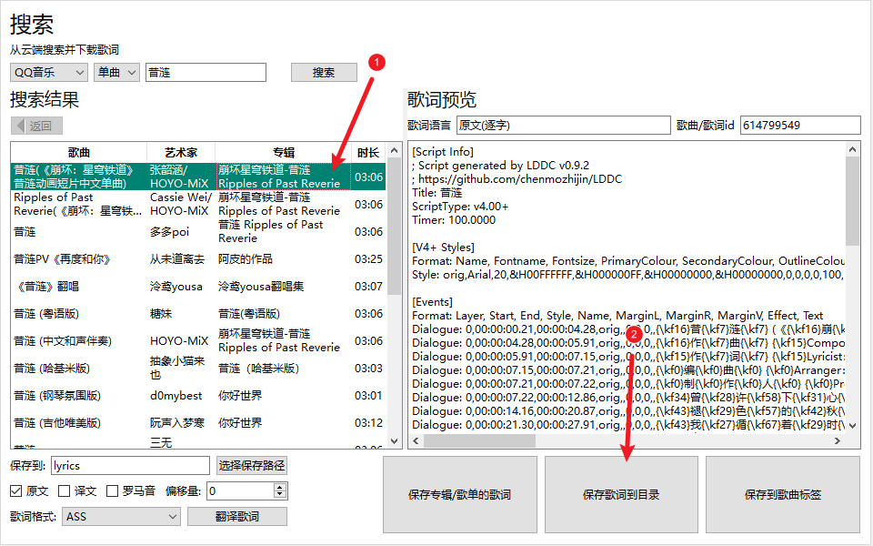

### 来自纯文本

1. 新建一个歌词文件；
1. 保存到本地文件夹（快捷键 <kbd>Ctrl</kbd> <kbd>S</kbd>）；
1. 粘贴到[行选择区域](#认识界面)；
   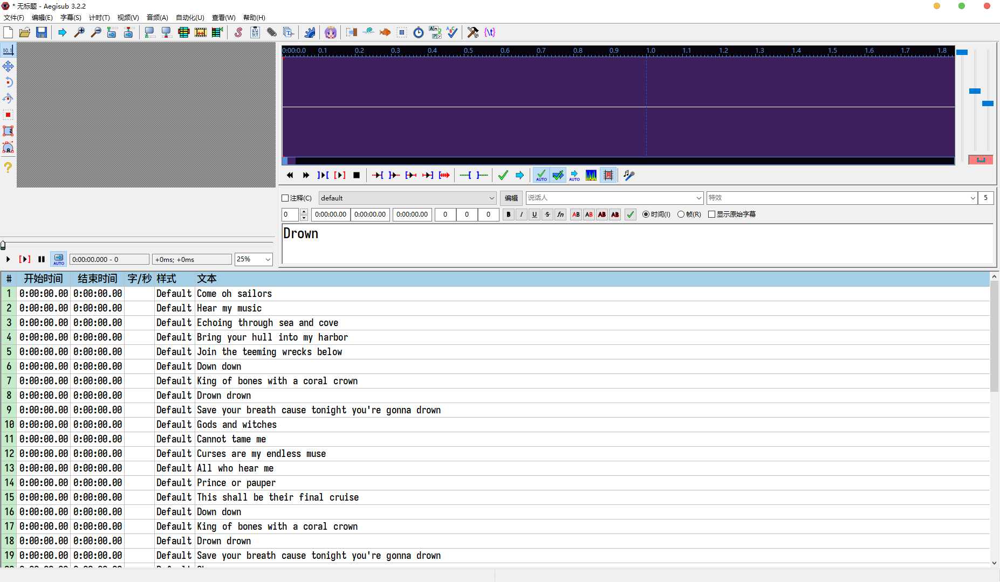
1. 选中所有原文内容，将结束时间设置为 `9:59:59:99`，行样式为 `orig`。
   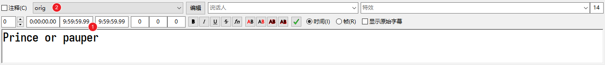

> [!NOTE]
>
> **无法设置行样式的情况**
>
> 如果样式栏下拉列表中没有目标样式，则表示当前字幕文件中没有对应样式，需要添加样式。
>
> 1. 打开[工具栏](#认识界面)的样式管理器 ；
>    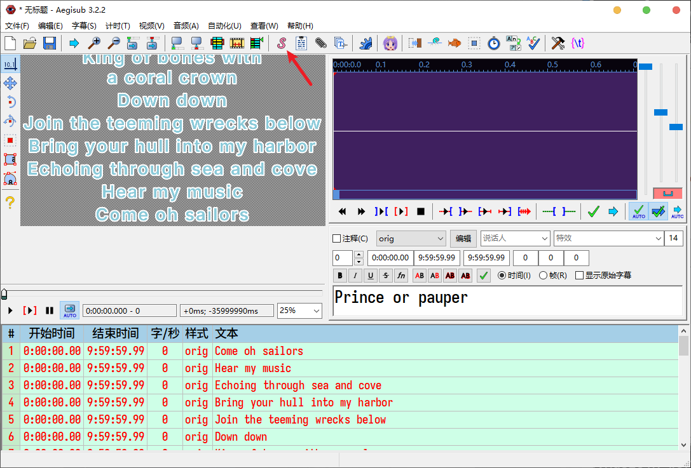
> 1. 选中需要的样式复制到当前脚本（①）或新建样式（②），再或者从其它脚本中导入（③）。
>    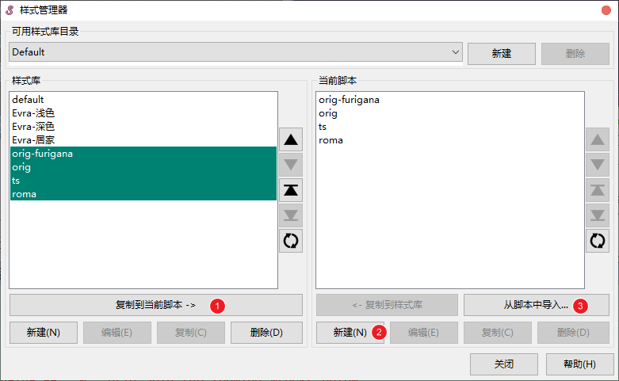
>
> *建议新建样式到样式库，这样每次新建文件将自动装载样式。*

> [!TIP]
>
> **不同样式对应的内容**
>
> - `orig` - 歌词原文；
> - `orig-furigana` - 振假名/其余标注，这种样式一般由软件在应用 Karaoke 模板时自动生成；
> - `ts` - 翻译；
> - `roma` - 注音，有时也称音译。

## 载入视频和音频

### 载入空白视频

点击[菜单栏](认识界面)的视频选项，点击  使用空白视频。

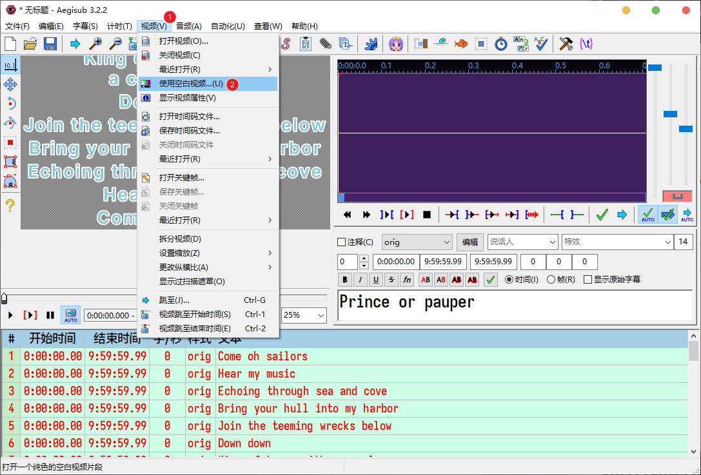

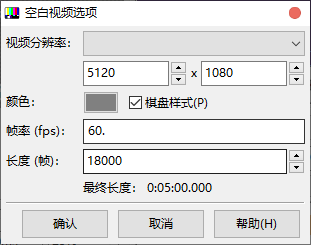

### 载入音频

点击[菜单栏](#认识界面)的音频选项，点击  打开音频文件。

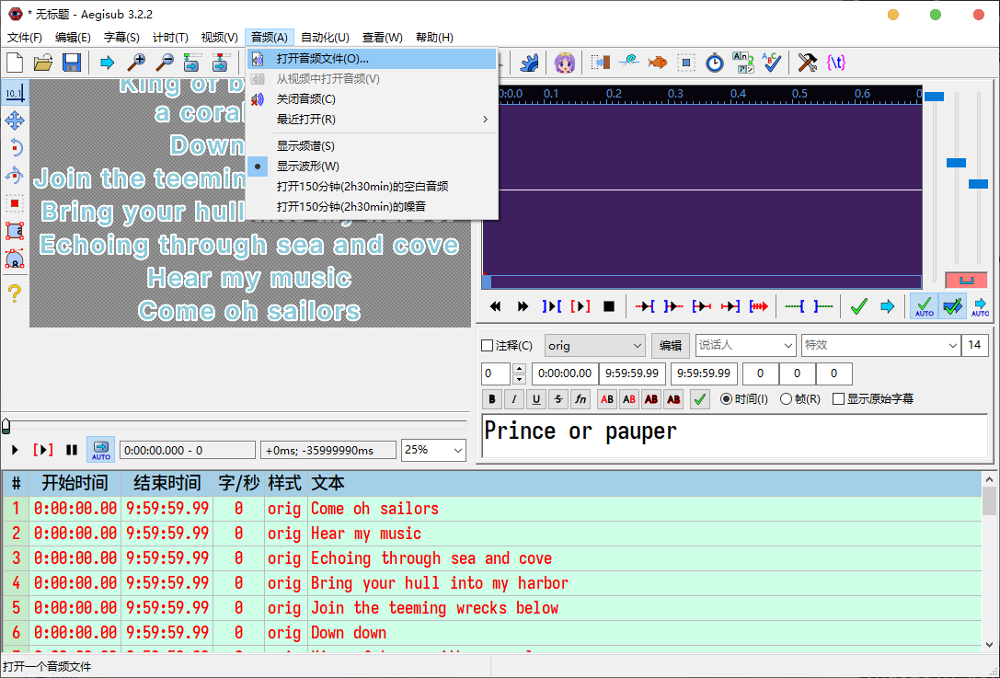

## 设置行起止时间

选中一行（如果有对应的翻译/音译行需要同时选中），将鼠标移动到[音频区域](#认识界面)，按住 <kbd>Ctrl</kbd> 键上下滑动鼠标滚轮缩放频谱图，使用鼠标上下滚轮前进或后退。单击鼠标左键设置行开始时间，单击鼠标右键设置行结束时间。

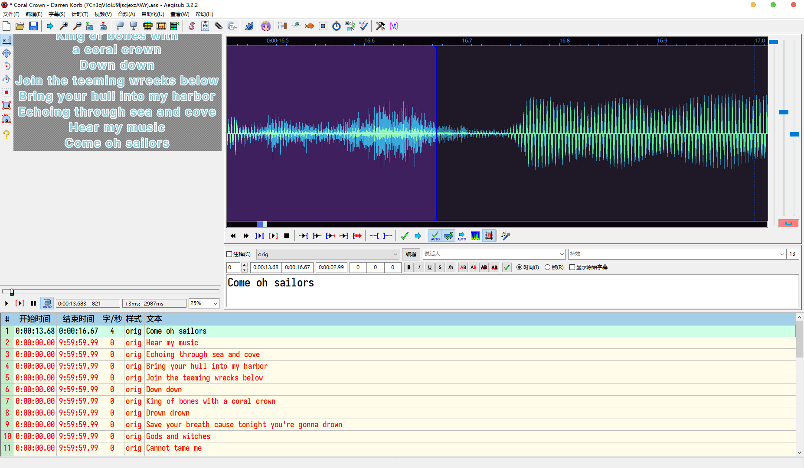

> [!TIP]
>
> 可以使用音频区域的      按键检查音频中的细节：
>
> 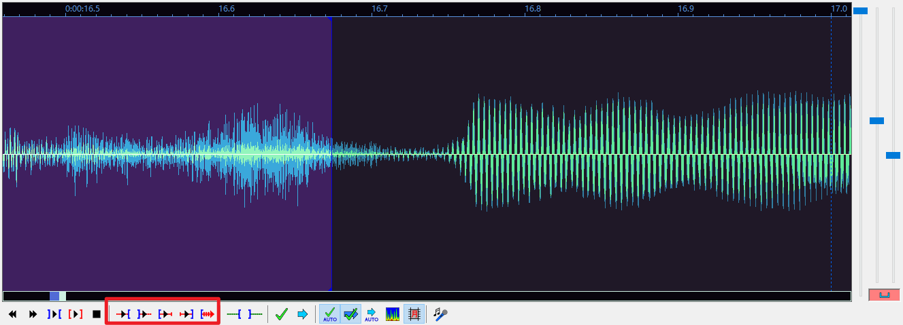

## 分词

1. 点击[音频区域](#认识界面)的  按钮切换到卡拉 OK 模式；
   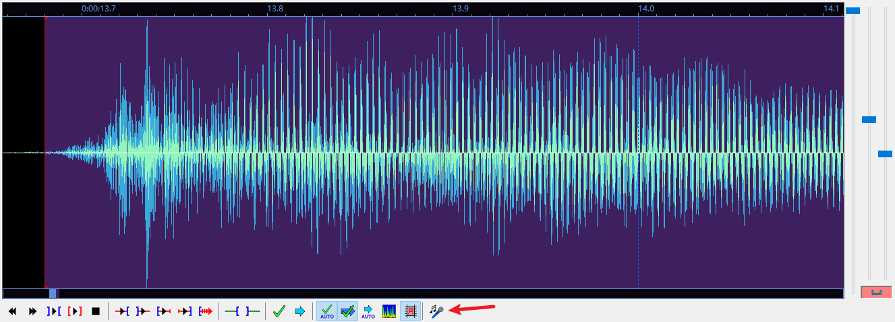
1. 在音频标签框内移动鼠标，分隔线随鼠标移动；
   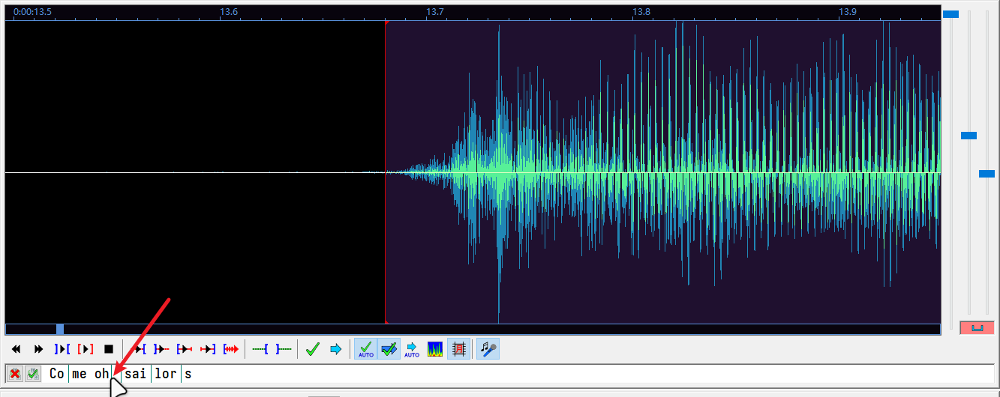
1. 当竖线为红色时，单击取消此处分词，当竖线为绿色时，单击在此处分词；
1. 分词结束后点击左侧  按钮保存。
   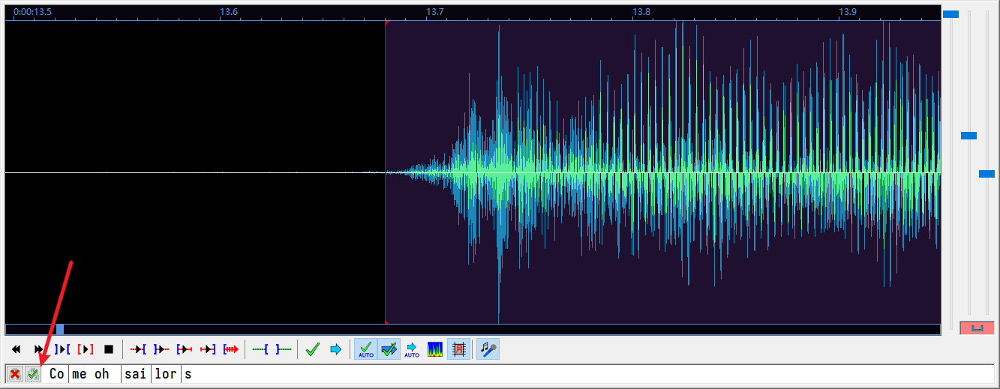

## 设置音节时间

1. 在频谱图区域内，将鼠标置于分隔线上，按住鼠标左键拖动，修改当前音节结束时间和下一音节起始时间，单击鼠标右键播放鼠标所在音节范围；
   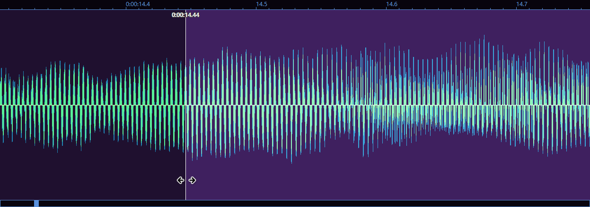
1. 在音频标签框中单击鼠标右键，弹出**卡拉 OK 标签**菜单，选择 `\kf`；
   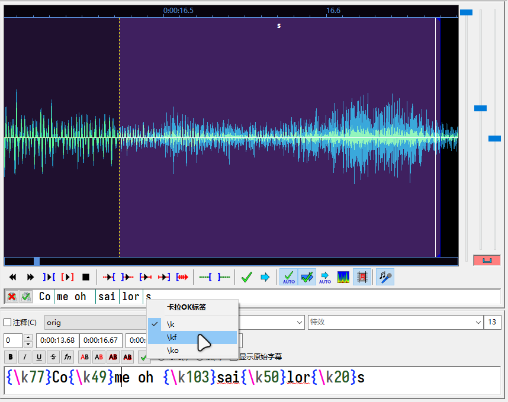
1. 在[视频区域](#认识界面)点击  按钮播放当前行，预览当前行情况。
   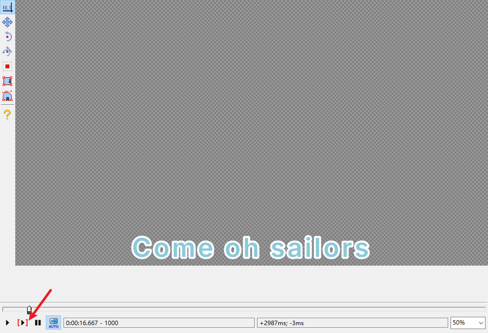